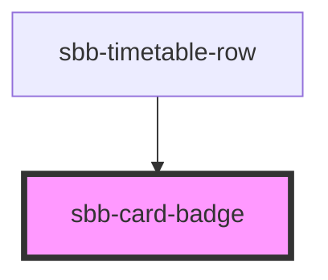

to be documented...

<!-- Auto Generated Below -->

## Properties

| Property     | Attribute     | Description           | Type                              | Default     |
| ------------ | ------------- | --------------------- | --------------------------------- | ----------- |
| `appearance` | `appearance`  | Badge appearance      | `"primary" \| "primary-negative"` | `'primary'` |
| `isDiscount` | `is-discount` | Mark as discount      | `boolean`                         | `undefined` |
| `price`      | `price`       | Price text            | `string`                          | `undefined` |
| `size`       | `size`        | Badge size            | `"regular"`                       | `'regular'` |
| `text`       | `text`        | From/above price text | `string`                          | `undefined` |

## Slots

| Slot        | Description                                                                                                                                                                                                             |
| ----------- | ----------------------------------------------------------------------------------------------------------------------------------------------------------------------------------------------------------------------- |
| `"generic"` | Slot used to render generic content. Since this slot is wrapped within a `span` only inline elements are allowed to be passed within this slot. Check https://developer.mozilla.org/en-US/docs/Web/HTML/Inline_elements |

## Dependencies

### Used by

 - [sbb-timetable-row](../sbb-timetable-row)

### Graph

----------------------------------------------

