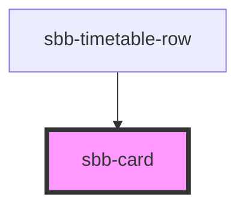

The `sbb-card` component is a generic content container as an action element; its task is to contain HTML elements related to a single subject.

Internally, it is either rendered as an anchor (`<a>`, when used with a `href` attribute) or as a button (when used without a `href` attribute).
When rendered as a button, it is possible to listen to the click event to add behavior.

There are six size variants available (from `xs` to `xxl`), which can be configured via the `size` attribute value,
and two background variants, white by default and milk when the `color` attribute is set to `milk`.
Set the `active` attribute to display the card in an active state, which is bordered and has no hover effect.

The `sbb-card-badge` component can be used via slot to display a badge in the upper right corner. 
The badge is hidden with sizes `xs` or `s`.

## Usage

The examples below shows how to use the component with and without the `<sbb-card-badge>` component.
In the first one, the `sbb-card` will be internally rendered as a button, in the second one as a link. 

```html
<sbb-card size="xl" color="milk">
  <sbb-card-badge slot="badge" appearance="primary" is-discount></sbb-card-badge>
  Card content
</sbb-card>

<sbb-card size="l" href="https://github.com/lyne-design-system/lyne-components" target="_blank">
  Card content
</sbb-card>
```

<!-- Auto Generated Below -->


## Properties

| Property   | Attribute  | Description                                                                     | Type                                         | Default     |
| ---------- | ---------- | ------------------------------------------------------------------------------- | -------------------------------------------- | ----------- |
| `active`   | `active`   | Used to set the component's active state.                                       | `boolean`                                    | `false`     |
| `color`    | `color`    | Option to set the component's background color.                                 | `"milk" \| "white"`                          | `'white'`   |
| `download` | `download` | Whether the browser will show the download dialog on click.                     | `boolean`                                    | `undefined` |
| `form`     | `form`     | The <form> element to associate the button with.                                | `string`                                     | `undefined` |
| `href`     | `href`     | The href value you want to link to.                                             | `string`                                     | `undefined` |
| `name`     | `name`     | The name of the button.                                                         | `string`                                     | `undefined` |
| `rel`      | `rel`      | The relationship of the linked URL as space-separated link types.               | `string`                                     | `undefined` |
| `size`     | `size`     | Size variant, either xs, s, m, l, xl or xxl.                                    | `"l" \| "m" \| "s" \| "xl" \| "xs" \| "xxl"` | `'m'`       |
| `target`   | `target`   | Where to display the linked URL.                                                | `string`                                     | `undefined` |
| `type`     | `type`     | Default behaviour of the button.                                                | `"button" \| "reset" \| "submit"`            | `undefined` |
| `value`    | `value`    | The value associated with button `name` when it's submitted with the form data. | `string`                                     | `undefined` |


## Slots

| Slot        | Description                        |
| ----------- | ---------------------------------- |
| `"badge"`   | Slot to render `<sbb-card-badge>`. |
| `"unnamed"` | Slot to render the content.        |


## Dependencies

### Used by

 - [sbb-timetable-row](../sbb-timetable-row)

### Graph


----------------------------------------------


