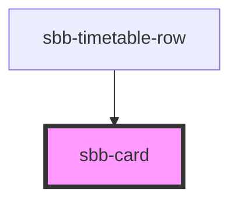

The `sbb-card` component is a generic content container; its task is to contain content related to a single subject. 
There are various sizes (affecting paddings) and colors available.

The `sbb-card-badge` component can be used via slot to display a badge in the upper right corner.
The badge is hidden with card sizes `xs` or `s`.

## Action

To add an action to a card, add a `<sbb-card-action>` to the main slot. With the `<sbb-card-action>` 
all the card area becomes clickable. 
Consult [API docs of `sbb-card-action`](/docs/components-sbb-card-sbb-card-action--docs) for detailed information.


## Accessibility

It's **important** that a descriptive message is being slotted into the unnamed slot of `<sbb-card-action>` 
as it is used for search engines and screen reader users. E.g. `<sbb-card-action>Buy a half-fare ticket now</sbb-card-action>`.

Normally, a `<sbb-card>` should be a single action, however it's possible to place other interactive elements
in the card content. Interactive content will automatically be detected and made accessible to click / focus.
In cases where there should be only a visual button or link inside the card content without a different action, the 
`is-static` attribute should be set (e.g. `<sbb-button is-static></sbb-button>`).

### High Contrast Additions

In high contrast mode all the content of a link or a button receives a specific color which overrides every other color. 
However, as the content of the card is not directly inside the button or link, this does not happen 
when the slotted content has a specific color set.
To improve coloring it's needed to manually define styles for high contrast mode (setting `LinkText` or `ButtonText`).


## Usage

The examples below shows how to use the component with and without the `<sbb-card-badge>` component.
In the first one, the `sbb-card` will be internally rendered as a button, in the second one as a link. 

Simple card:

```html
<sbb-card size="xl" color="milk">
  Card content
</sbb-card>
```

Card with badge:

```html
<sbb-card size="m" color="white">
  <sbb-card-badge>
    <span>%</span>
    <span>from CHF</span>
    <span>19.99</span>
  </sbb-card-badge>
  Card content
</sbb-card>
```

Card with action:

```html
<sbb-card size="xl" color="milk">
  <sbb-card-action href="https://www.sbb.ch">Check all the wonderful trips available.</sbb-card-action>
  Buy trips
</sbb-card>
```

<!-- Auto Generated Below -->


## Properties

| Property | Attribute | Description                                        | Type                                                                           | Default   |
| -------- | --------- | -------------------------------------------------- | ------------------------------------------------------------------------------ | --------- |
| `color`  | `color`   | Option to set the component's background color.    | `"milk" \| "transparent-bordered" \| "transparent-bordered-dashed" \| "white"` | `'white'` |
| `size`   | `size`    | Size variant, either xs, s, m, l, xl, xxl or xxxl. | `"l" \| "m" \| "s" \| "xl" \| "xs" \| "xxl" \| "xxxl"`                         | `'m'`     |


## Slots

| Slot        | Description                        |
| ----------- | ---------------------------------- |
| `"badge"`   | Slot to render `<sbb-card-badge>`. |
| `"unnamed"` | Slot to render the content.        |


## Dependencies

### Used by

 - [sbb-timetable-row](../sbb-timetable-row)

### Graph


----------------------------------------------


