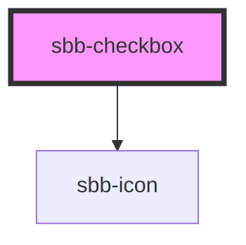

# sbb-checkbox

<!-- Auto Generated Below -->

## Properties

| Property                   | Attribute                    | Description                                                              | Type            | Default                      |
| -------------------------- | ---------------------------- | ------------------------------------------------------------------------ | --------------- | ---------------------------- |
| `acceccibilityDescribedBy` | `acceccibility-described-by` | The aria-describedby prop for the hidden input.                          | `string`        | `undefined`                  |
| `acceccibilityLabel`       | `acceccibility-label`        | The aria-label prop for the hidden input.                                | `string`        | `undefined`                  |
| `acceccibilityLabelledby`  | `acceccibility-labelledby`   | The aria-labelledby prop for the hidden input.                           | `string`        | `undefined`                  |
| `checkIcon`                | `check-icon`                 |                                                                          | `"tick-small"`  | `undefined`                  |
| `checked`                  | `checked`                    | Whether the checkbox is checked.                                         | `boolean`       | `undefined`                  |
| `disabled` _(required)_    | `disabled`                   | The disabled prop for the disabled state.                                | `boolean`       | `undefined`                  |
| `inputId`                  | `input-id`                   | Id of the internal input element - default id will be set automatically. | `string`        | ``sbb-checkbox-${++nextId}`` |
| `labelIcon`                | `label-icon`                 |                                                                          | `""`            | `undefined`                  |
| `labelReversed`            | `label-reversed`             | The label position relative to the labelIcon. Defaults to false          | `boolean`       | `false`                      |
| `labelSpace`               | `label-space`                | Whether the checkbox label has spacing to the labelIcon.                 | `boolean`       | `false`                      |
| `name`                     | `name`                       | Name of the checkbox                                                     | `string`        | `undefined`                  |
| `required`                 | `required`                   | The required prop for the required state.                                | `boolean`       | `undefined`                  |
| `tristateIcon`             | `tristate-icon`              |                                                                          | `"minus-small"` | `undefined`                  |
| `tristated`                | `tristated`                  | Whether the checkbox is tristated.                                       | `boolean`       | `undefined`                  |
| `value`                    | `value`                      | Value of checkbox.                                                       | `string`        | `undefined`                  |

## Events

| Event       | Description                                      | Type               |
| ----------- | ------------------------------------------------ | ------------------ |
| `sbbChange` | Event for emiting whenever selection is changed. | `CustomEvent<any>` |

## Dependencies

### Depends on

- [sbb-icon](../sbb-icon)

### Graph

----------------------------------------------

