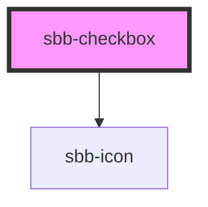

`<sbb-checkbox>` provides the same functionality as a native `<input type="checkbox">`
enhanced with the SBB Design.

```html
<sbb-checkbox
  value="single-checkbox"
  disabled="false"
  checked="false"
>
  Example
</sbb-checkbox>
```

Example with an Icon:

```html
<sbb-checkbox
  value="single-checkbox"
  disabled="false"
  checked="false"
  icon-name= "tickets-class-small"
>
  Example
</sbb-checkbox>
```
Example with an Icon and placement before the label:

```html
<sbb-checkbox
  value="single-checkbox"
  disabled="false"
  checked="false"
  icon-name= "tickets-class-small"
  icon-placement= "start"
>
  Example
</sbb-checkbox>
```
## Label

The label is provided as the content to the `<sbb-checkbox>` element.
It can be displayed after or before the checkbox with the `icon-placement` property. 

If you don't want the label to appear next to the checkbox, you can use
`accessibility-label` (forwarded as [`aria-label`](https://www.w3.org/TR/WCAG20-TECHS/ARIA14.html)) or
`accessibility-labelledby` (forwarded as [`aria-labelledby`](https://www.w3.org/TR/WCAG20-TECHS/ARIA16.html)) to
specify an appropriate label.

## Accessibility

`SbbCheckbox` uses an internal `<input type="checkbox">` to provide an accessible experience.
This internal checkbox receives focus and is automatically labelled by the text content of the
`<sbb-checkbox>` element. Avoid adding other interactive controls into the content of
`<sbb-checkbox>`, as this degrades the experience for users of assistive technology.

Always provide an accessible label via `accessibility-label` or `accessibility-labelledby` for checkboxes without
descriptive text content.

Additionaly you can use `accessibility-describedby` (forwarded as [`aria-describedby`](https://www.w3.org/TR/WCAG20-TECHS/ARIA1.html))
to describe the element on which the attribute is set.

```html
<sbb-checkbox accessibility-label="Subscribed to email message" />
```

<!-- Auto Generated Below -->


## Properties

| Property                   | Attribute                   | Description                                                                                                                                         | Type               | Default                      |
| -------------------------- | --------------------------- | --------------------------------------------------------------------------------------------------------------------------------------------------- | ------------------ | ---------------------------- |
| `accessibilityDescribedby` | `accessibility-describedby` | The aria-describedby prop for the hidden input.                                                                                                     | `string`           | `undefined`                  |
| `accessibilityLabel`       | `accessibility-label`       | The aria-label prop for the hidden input.                                                                                                           | `string`           | `undefined`                  |
| `accessibilityLabelledby`  | `accessibility-labelledby`  | The aria-labelledby prop for the hidden input.                                                                                                      | `string`           | `undefined`                  |
| `checked`                  | `checked`                   | Whether the checkbox is checked.                                                                                                                    | `boolean`          | `undefined`                  |
| `disabled`                 | `disabled`                  | The disabled prop for the disabled state.                                                                                                           | `boolean`          | `false`                      |
| `iconName`                 | `icon-name`                 | The icon name we want to use, choose from the small icon variants from the ui-icons category from here https://lyne.sbb.ch/tokens/icons (optional). | `string`           | `undefined`                  |
| `iconPlacement`            | `icon-placement`            | The label position relative to the labelIcon. Defaults to end                                                                                       | `"end" \| "start"` | `'end'`                      |
| `indeterminate`            | `indeterminate`             | Whether the checkbox is indeterminate.                                                                                                              | `boolean`          | `false`                      |
| `inputId`                  | `input-id`                  | Id of the internal input element - default id will be set automatically.                                                                            | `string`           | ``sbb-checkbox-${++nextId}`` |
| `name`                     | `name`                      | Name of the checkbox                                                                                                                                | `string`           | `undefined`                  |
| `required`                 | `required`                  | The required prop for the required state.                                                                                                           | `boolean`          | `false`                      |
| `value`                    | `value`                     | Value of checkbox.                                                                                                                                  | `string`           | `undefined`                  |


## Events

| Event       | Description                                       | Type                             |
| ----------- | ------------------------------------------------- | -------------------------------- |
| `sbbChange` | Event for emitting whenever selection is changed. | `CustomEvent<SbbCheckboxChange>` |


## Slots

| Slot        | Description                                    |
| ----------- | ---------------------------------------------- |
| `"icon"`    | Slot used to render the checkbox icon.         |
| `"unnamed"` | Slot used to render the checkbox label's text. |


## Dependencies

### Depends on

- [sbb-icon](../sbb-icon)

### Graph


----------------------------------------------


