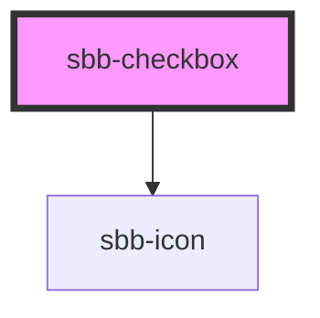

The `<sbb-checkbox>` component provides the same functionality as a native `<input type="checkbox">` enhanced with the SBB Design.

The component has two `size`, named `s` (default) and `m`. 
It could be checked or not depending on the value of the `checked` attribute. 
It has a third state too, which is set if the `indeterminate` property is true. This is useful when multiple dependent 
checkboxes are used (e.g. a parent which is checked only if all the children are checked, otherwise is in indeterminate state).
Clicking on a `sbb-checkbox` in this state sets `checked` to `true` and `indeterminate` to false. 

The component can be displayed in disabled or required state by using the self-named properties.

It is possible to provide a label via an unnamed slot; the component can optionally display a `<sbb-icon>` using 
the `iconName` property or via custom SVG using the `icon` slot.
The icon can be placed before or after the label based on the value of the `iconPlacement` property (default: end).

Consumers can listen to the native `change` event on the `sbb-checkbox` component to intercept the input's change;
the current state can be read from `event.target.checked`, while the value from `event.target.value`.

## Usage

Checked:

```html
<sbb-checkbox value="single-checkbox" checked="true">
  Example
</sbb-checkbox>
```

Unchecked and disabled with icon

```html
<sbb-checkbox value="single-checkbox" disabled="false" checked="false" icon-name= "tickets-class-small">
  Example
</sbb-checkbox>
```

Indeterminate and required with icon placed before the label

```html
<sbb-checkbox value="single-checkbox" required="true" indeterminate="true" icon-name="tickets-class-small" icon-placement="start">
  Example
</sbb-checkbox>
```

## Accessibility

The component uses an internal `<input type="checkbox">` element to provide an accessible experience.
This internal checkbox receives focus and is automatically labelled by the text content of the
`<sbb-checkbox>` element. Avoid adding other interactive controls into the content of
`<sbb-checkbox>`, as this degrades the experience for users of assistive technology.

Always provide an accessible label via `aria-label` for checkboxes without
descriptive text content.
If you don't want the label to appear next to the checkbox, you can use
`aria-label` to specify an appropriate label.

```html
<sbb-checkbox aria-label="Subscribed to email message" />
```

<!-- Auto Generated Below -->


## Properties

| Property        | Attribute        | Description                                                                                                                            | Type               | Default     |
| --------------- | ---------------- | -------------------------------------------------------------------------------------------------------------------------------------- | ------------------ | ----------- |
| `checked`       | `checked`        | Whether the checkbox is checked.                                                                                                       | `boolean`          | `false`     |
| `disabled`      | `disabled`       | Whether the checkbox is disabled.                                                                                                      | `boolean`          | `false`     |
| `iconName`      | `icon-name`      | The icon name we want to use, choose from the small icon variants from the ui-icons category from https://icons.app.sbb.ch (optional). | `string`           | `undefined` |
| `iconPlacement` | `icon-placement` | The label position relative to the labelIcon. Defaults to end                                                                          | `"end" \| "start"` | `'end'`     |
| `indeterminate` | `indeterminate`  | Whether the checkbox is indeterminate.                                                                                                 | `boolean`          | `false`     |
| `required`      | `required`       | Whether the checkbox is required.                                                                                                      | `boolean`          | `false`     |
| `size`          | `size`           | Label size variant, either m or s.                                                                                                     | `"m" \| "s"`       | `'m'`       |
| `value`         | `value`          | Value of checkbox.                                                                                                                     | `string`           | `undefined` |


## Events

| Event       | Description                                                                                                                         | Type               |
| ----------- | ----------------------------------------------------------------------------------------------------------------------------------- | ------------------ |
| `didChange` | <span style="color:red">**[DEPRECATED]**</span> only used for React. Will probably be removed once React 19 is available.<br/><br/> | `CustomEvent<any>` |


## Slots

| Slot        | Description                                                                                     |
| ----------- | ----------------------------------------------------------------------------------------------- |
| `"icon"`    | Slot used to render the checkbox icon (disabled inside a selection panel).                      |
| `"subtext"` | Slot used to render a subtext under the label (only visible within a selection panel).          |
| `"suffix"`  | Slot used to render additional content after the label (only visible within a selection panel). |
| `"unnamed"` | Slot used to render the checkbox label's text.                                                  |


## Dependencies

### Depends on

- [sbb-icon](../sbb-icon)

### Graph


----------------------------------------------


