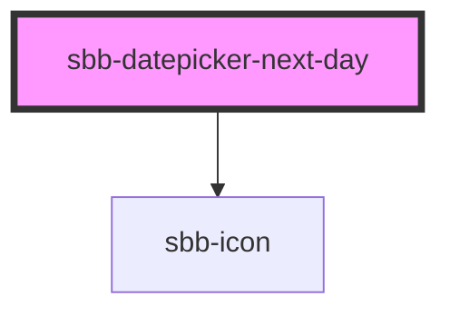

The `sbb-datepicker-next-day` is a component closely connected to the [sbb-datepicker](/docs/components-sbb-datepicker-sbb-datepicker--docs);
when the two are used together, the `sbb-datepicker-next-day` can be used to choose
the date after the selected date, or tomorrow's date if the date-picker's input has no defined value.

The components can be connected using the `datePicker` property, which accepts the id of the `sbb-datepicker`,
or directly its reference.

```html
<input id="datepicker-input" />
<sbb-datepicker input="datepicker-input" id="datepicker"></sbb-datepicker>
<sbb-datepicker-next-day date-picker="datepicker"></sbb-datepicker-next-day>
```

## In `sbb-form-field`

If the two components are used within a [sbb-form-field](/docs/components-sbb-form-field-sbb-form-field--docs), 
they are automatically linked and the `sbb-datepicker-next-day` will be projected in the `suffix` slot of the `sbb-form-field`; 
otherwise, they can be connected using the `datePicker` property as described above.

The `sbb-datepicker-next-day` has an internal disabled state, which is set looking at the `sbb-datepicker`'s input:
if it is disabled, or if the selected date is equal to the input's `max` attribute, the component is disabled.

```html
<sbb-form-field>
  <input />
  <sbb-datepicker></sbb-datepicker>
  <sbb-datepicker-next-day></sbb-datepicker-next-day>
</sbb-form-field>
```

<!-- Auto Generated Below -->


## Properties

| Property     | Attribute     | Description                               | Type                    | Default     |
| ------------ | ------------- | ----------------------------------------- | ----------------------- | ----------- |
| `datePicker` | `date-picker` | Datepicker reference.                     | `HTMLElement \| string` | `undefined` |
| `name`       | `name`        | The name attribute to use for the button. | `string`                | `undefined` |
| `negative`   | `negative`    | Negative coloring variant flag.           | `boolean`               | `false`     |


## Dependencies

### Depends on

- [sbb-icon](../sbb-icon)

### Graph


----------------------------------------------


