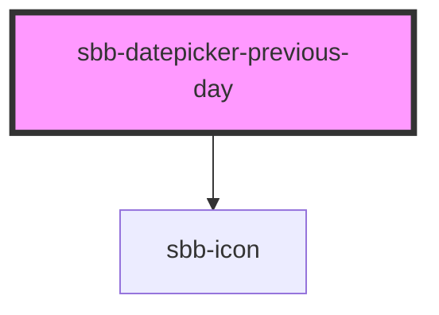

The `sbb-datepicker-previous-day` is a component closely connected to the `sbb-datepicker`;
when the two are used together, the `sbb-datepicker-previous-day` can be used to choose 
the date before the selected date, or yesterday's date if the date-picker's input has no defined value.

If the two components are used within a `sbb-form-field`, they are automatically linked and 
the `sbb-datepicker-previous-day` will be projected in the `prefix` slot of the `sbb-form-field`; otherwise, 
they can be connected using the `datePicker` property, which accepts the id of the `sbb-datepicker`,
or directly its reference. 

The `sbb-datepicker-previous-day` has an internal disabled state, which is set looking at the `sbb-datepicker`'s input:
if it is disabled, or if the selected date is equal to the input's `min` attribute, the component is disabled. 


## Usage

Inside `sbb-form-field`:
```html
    <sbb-form-field>
      <sbb-datepicker-previous-day></sbb-datepicker-previous-day>
      <input />
      <sbb-datepicker></sbb-datepicker>
      <sbb-datepicker-next-day></sbb-datepicker-next-day>
    </sbb-form-field>
```

<!-- Auto Generated Below -->


## Properties

| Property     | Attribute     | Description                               | Type                    | Default     |
| ------------ | ------------- | ----------------------------------------- | ----------------------- | ----------- |
| `datePicker` | `date-picker` | Datepicker reference.                     | `HTMLElement \| string` | `undefined` |
| `disabled`   | `disabled`    | Whether the button is disabled            | `boolean`               | `false`     |
| `name`       | `name`        | The name attribute to use for the button. | `string`                | `undefined` |


## Dependencies

### Depends on

- [sbb-icon](../sbb-icon)

### Graph


----------------------------------------------


