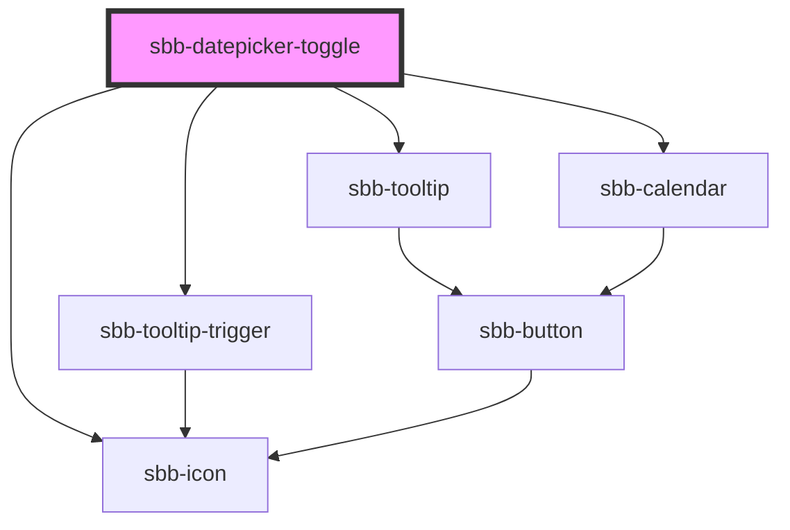

# sbb-datepicker-toggle

<!-- Auto Generated Below -->

## Properties

| Property     | Attribute     | Description          | Type                    | Default     |
| ------------ | ------------- | -------------------- | ----------------------- | ----------- |
| `datePicker` | `date-picker` | Datepicker reference | `HTMLElement \| string` | `undefined` |

## Dependencies

### Depends on

- [sbb-icon](../sbb-icon)
- [sbb-tooltip-trigger](../sbb-tooltip-trigger)
- [sbb-tooltip](../sbb-tooltip)
- [sbb-calendar](../sbb-calendar)

### Graph

----------------------------------------------

