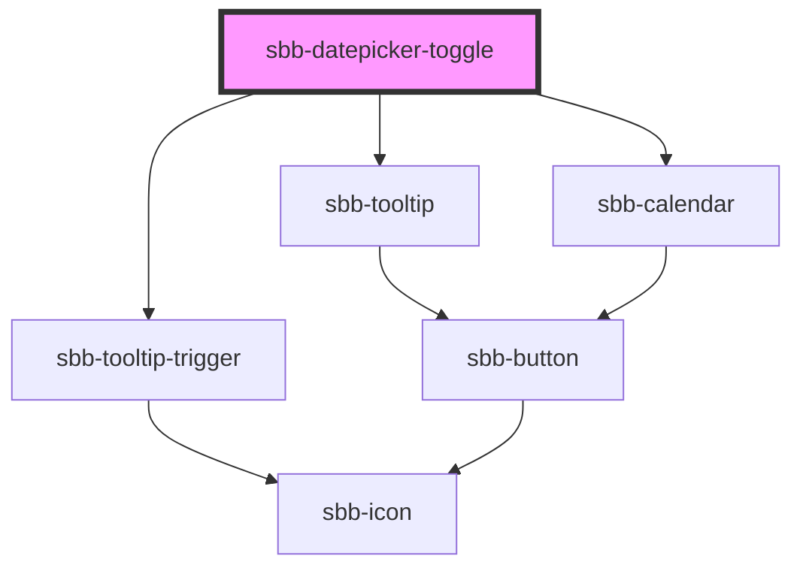

The `sbb-datepicker-toggle` is a component closely connected to the `sbb-datepicker`.
When the two are used together, the `sbb-datepicker-toggle` can be used to link the `sbb-datepicker` to a `sbb-calendar`:
a change in the latter, like selecting a date, is propagated to the former; and conversely, changes in the `sbb-datepicker`
properties, or in the date-picker's input attributes, are propagated to the `sbb-calendar` to modify its appearance.

If the two components are used within a `sbb-form-field`, they are automatically linked and
the `sbb-datepicker-toggle` will be projected in the `prefix` slot of the `sbb-form-field`; otherwise,
they can be connected using the `datePicker` property, which accepts the id of the `sbb-datepicker`,
or directly its reference.

The `wide` property from the `sbb-datepicker` can be used to display the calendar in a two months
view, while the `dateFilter` property can be used to filter unwanted dates.


## Usage

Inside `sbb-form-field`:

```html
    <sbb-form-field>
      <sbb-datepicker-previous-day></sbb-datepicker-previous-day>
      <sbb-datepicker-toggle></sbb-datepicker-toggle>
      <input />
      <sbb-datepicker></sbb-datepicker>
      <sbb-datepicker-next-day></sbb-datepicker-next-day>
    </sbb-form-field>
```

<!-- Auto Generated Below -->


## Properties

| Property           | Attribute           | Description                        | Type                    | Default     |
| ------------------ | ------------------- | ---------------------------------- | ----------------------- | ----------- |
| `datePicker`       | `date-picker`       | Datepicker reference.              | `HTMLElement \| string` | `undefined` |
| `disableAnimation` | `disable-animation` | Whether the animation is disabled. | `boolean`               | `false`     |


## Methods

### `open() => Promise<void>`

Opens the calendar.

#### Returns

Type: `Promise<void>`


## Dependencies

### Depends on

- [sbb-tooltip-trigger](../sbb-tooltip-trigger)
- [sbb-tooltip](../sbb-tooltip)
- [sbb-calendar](../sbb-calendar)

### Graph


----------------------------------------------


