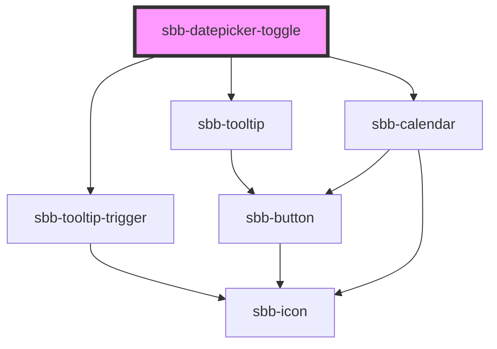

The `sbb-datepicker-toggle` is a component 
closely connected to the [sbb-datepicker](/docs/components-sbb-datepicker-sbb-datepicker--docs).

When the two are used together, the `sbb-datepicker-toggle` can be used to link the `sbb-datepicker` 
to a [sbb-calendar](/docs/components-sbb-datepicker-sbb-calendar--docs):
a change in the latter, like selecting a date, is propagated to the former; and conversely, changes in the `sbb-datepicker`
properties, or in the date-picker's input attributes, are propagated to the `sbb-calendar` to modify its appearance.

The components can be connected using the `datePicker` property, which accepts the id of the `sbb-datepicker`,
or directly its reference.

```html
<sbb-datepicker-toggle date-picker="datepicker"></sbb-datepicker-toggle>
<input id="datepicker-input" />
<sbb-datepicker input="datepicker-input" id="datepicker"></sbb-datepicker>
```

## In `sbb-form-field`

If the two components are used within a [sbb-form-field](/docs/components-sbb-form-field-sbb-form-field--docs), 
they are automatically linked and the `sbb-datepicker-toggle` will be projected in the `prefix` slot of the `sbb-form-field`; 
otherwise, they can be connected using the `datePicker` property as described above.

```html
<sbb-form-field>
  <sbb-datepicker-toggle></sbb-datepicker-toggle>
  <input />
  <sbb-datepicker></sbb-datepicker>
</sbb-form-field>
```

<!-- Auto Generated Below -->


## Properties

| Property           | Attribute           | Description                        | Type                    | Default     |
| ------------------ | ------------------- | ---------------------------------- | ----------------------- | ----------- |
| `datePicker`       | `date-picker`       | Datepicker reference.              | `HTMLElement \| string` | `undefined` |
| `disableAnimation` | `disable-animation` | Whether the animation is disabled. | `boolean`               | `false`     |
| `negative`         | `negative`          | Negative coloring variant flag.    | `boolean`               | `false`     |


## Methods

### `open() => Promise<void>`

Opens the calendar.

#### Returns

Type: `Promise<void>`


## Dependencies

### Depends on

- [sbb-tooltip-trigger](../sbb-tooltip-trigger)
- [sbb-tooltip](../sbb-tooltip)
- [sbb-calendar](../sbb-calendar)

### Graph


----------------------------------------------


