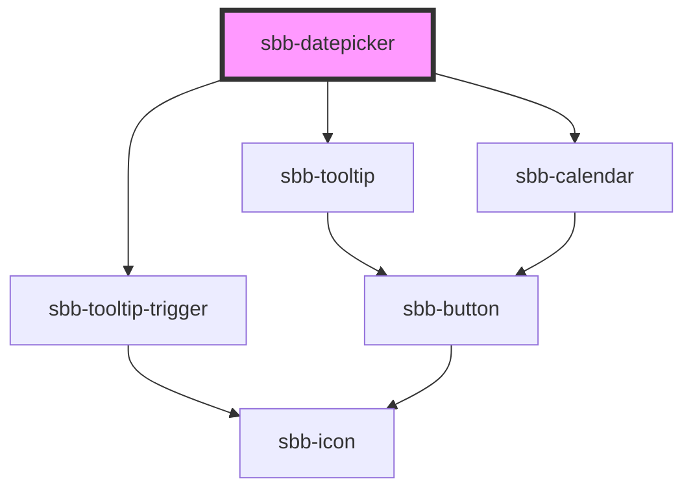

# sbb-datepicker

<!-- Auto Generated Below -->

## Properties

| Property     | Attribute | Description                              | Type                       | Default      |
| ------------ | --------- | ---------------------------------------- | -------------------------- | ------------ |
| `dateFilter` | --        | A function used to filter out dates.     | `(date: Date) => boolean`  | `() => true` |
| `max`        | `max`     | The maximum valid date.                  | `Date \| number \| string` | `undefined`  |
| `min`        | `min`     | The minimum valid date.                  | `Date \| number \| string` | `undefined`  |
| `wide`       | `wide`    | If set to true, two months are displayed | `boolean`                  | `false`      |

## Dependencies

### Depends on

- [sbb-tooltip-trigger](../sbb-tooltip-trigger)
- [sbb-tooltip](../sbb-tooltip)
- [sbb-calendar](../sbb-calendar)

### Graph

----------------------------------------------

