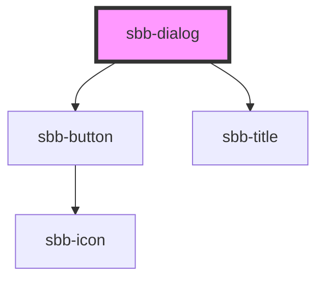

The `sbb-dialog` component provides a way to present content on top of the app's content and can be used
in several contexts. The dialog offers the following features:

- creates a backdrop for disabling interaction below the modal;
- disables scrolling of the page content while open;
- manages focus properly by setting it on the first focusable element;
- can have a header and a footer, both of which are optional;
- can host an `sbb-action-group` component in the footer;
- has a close button, which is always visible;
- can display a back button next to the title;
- adds the appropriate ARIA roles automatically.

The dialog box can be dismissed by clicking on the close button, clicking on the backdrop, or
pressing the `Esc` key.

**NOTE**: `<sbb-dialog>` will automatically set size `m` on slotted `<sbb-action-group>` in the
 `action-group` slot.

## Usage

In order to show a modal, you need to call the `open(event?: PointerEvent)` method on the
`<sbb-dialog>` component:

```html
<sbb-button label="Open dialog" click="openDialog(event, 'my-dialog')"></sbb-button>
<sbb-dialog id="my-dialog" title-content="Title" title-back-button="true">
  Dialog content.
  <div slot="action-group">...</div>
</sbb-dialog>

<script>
  const openDialog = (event, id) => {
    const dialog = document.getElementById(id);
    dialog.open(event);
  };
</script>
```

Note that it is necessary to pass the event object to the `open()` method to allow the dialog to
detect whether it has been opened by click or keyboard, so that the focus can be better handled.

To dismiss the dialog, you need to get a reference to the `<sbb-dialog>` element and call 
the `close(result?: any, target?: HTMLElement)` method, which will close the dialog element and
emit a close event with an optional result as a payload. You can also indicate that an element
within the dialog content should close the dialog when clicked by marking it with the
`sbb-dialog-close` attribute.

### Usage notes

The default `z-index` of the component is set to `1000`; to specify a custom stack order, the
`z-index` can be changed by defining the CSS variable `--sbb-dialog-z-index`. 

The dialog title can be provided via the `titleContent` property and via slot `name="title"` 
(e.g. `<span slot="title">My dialog title</span>`). 
You can also set the property `titleBackButton` to display the back button in the title section 
(or content section, if title is omitted) which will emit the event `request-back-action`
when clicked. 

```html
// Title provided via property
<sbb-dialog id="my-dialog" title-content="Title" title-back-button="true">
  Dialog content.
  <sbb-action-group slot="action-group">
    <sbb-button sbb-dialog-close>Abort</sbb-button>
    <sbb-button>Confirm</sbb-button>
  </sbb-action-group>
</sbb-dialog>

// Slotted title
<sbb-dialog id="my-dialog" title-back-button="true">
  <span slot="title">My dialog title</span>
  Dialog content.
  <sbb-action-group slot="action-group">
    <sbb-button sbb-dialog-close>Abort</sbb-button>
    <sbb-button>Confirm</sbb-button>
  </sbb-action-group>
</sbb-dialog>
```

If the title is not provided, the dialog will be displayed in fullscreen mode and the close button
will be displayed in the content section along with the back button (if visible). 
Also note that if the title is not present, but the footer is provided, the footer will not be
displayed.

<!-- Auto Generated Below -->


## Properties

| Property                  | Attribute                   | Description                                                                     | Type                                     | Default     |
| ------------------------- | --------------------------- | ------------------------------------------------------------------------------- | ---------------------------------------- | ----------- |
| `accessibilityBackLabel`  | `accessibility-back-label`  | This will be forwarded as aria-label to the back button element.                | `string`                                 | `undefined` |
| `accessibilityCloseLabel` | `accessibility-close-label` | This will be forwarded as aria-label to the close button element.               | `string`                                 | `undefined` |
| `accessibilityLabel`      | `accessibility-label`       | This will be forwarded as aria-label to the relevant nested element.            | `string`                                 | `undefined` |
| `backdropAction`          | `backdrop-action`           | Backdrop click action.                                                          | `"close" \| "none"`                      | `'close'`   |
| `disableAnimation`        | `disable-animation`         | Whether the animation is enabled.                                               | `boolean`                                | `false`     |
| `negative`                | `negative`                  | Negative coloring variant flag.                                                 | `boolean`                                | `false`     |
| `titleBackButton`         | `title-back-button`         | Whether a back button is displayed next to the title.                           | `boolean`                                | `false`     |
| `titleContent`            | `title-content`             | Dialog title.                                                                   | `string`                                 | `undefined` |
| `titleLevel`              | `title-level`               | Level of title, will be rendered as heading tag (e.g. h1). Defaults to level 1. | `"1" \| "2" \| "3" \| "4" \| "5" \| "6"` | `'1'`       |


## Events

| Event                 | Description                                              | Type                |
| --------------------- | -------------------------------------------------------- | ------------------- |
| `did-close`           | Emits whenever the dialog is closed.                     | `CustomEvent<any>`  |
| `did-open`            | Emits whenever the dialog is opened.                     | `CustomEvent<void>` |
| `request-back-action` | Emits whenever the back button is clicked.               | `CustomEvent<void>` |
| `will-close`          | Emits whenever the dialog begins the closing transition. | `CustomEvent<any>`  |
| `will-open`           | Emits whenever the dialog starts the opening transition. | `CustomEvent<void>` |


## Methods

### `close(result?: any, target?: HTMLElement) => Promise<any>`

Closes the dialog element.

#### Returns

Type: `Promise<any>`


### `open() => Promise<void>`

Opens the dialog element.

#### Returns

Type: `Promise<void>`


## Slots

| Slot             | Description                                             |
| ---------------- | ------------------------------------------------------- |
| `"action-group"` | Use this slot to display an action group in the footer. |
| `"title"`        | Use this slot to provide a title.                       |
| `"unnamed"`      | Use this slot to provide the dialog content.            |


## Dependencies

### Depends on

- [sbb-button](../sbb-button)
- [sbb-title](../sbb-title)

### Graph


----------------------------------------------


