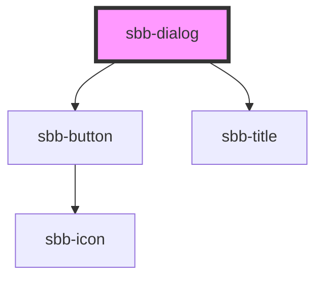

# sbb-dialog
The dialog component provides a way to present content on top of the app's content and can be used in several contexts. The dialog offers the following features:

- creates a backdrop, for disabling interaction below the modal;
- disables scrolling of the page content while open;
- manages focus properly by setting it on the first focusable element;
- can have a header and a footer, both of which are optional;
- can host an `sbb-action-group` component in the footer;
- has a close button, which is always visible;
- can display a back button next to the title;
- adds the appropriate ARIA roles automatically.

The dialog box can be dismissed by clicking on the close button, clicking on the backdrop, or pressing the `Esc` key.

## Usage
In order to show a modal you need to call the `open(event?: PointerEvent)` method on the `sbb-dialog` component:

```html
<sbb-button label="Open dialog" click="openDialog(event, 'my-dialog')"></sbb-button>
<sbb-dialog id="my-dialog" title-content="Title" title-back-button="true">
  Dialog content.
  <div slot="action-group">...</div>
</sbb-dialog>

<script>
  const openDialog = (event, id) => {
    const dialog = document.getElementById(id);
    dialog.open(event);
  };
</script>
```

Note that it is necessary to pass the event object to the `open()` method to allow the dialog to detect whether it has been opened by click or keyboard, so that the focus can be better handled.

To dismiss the dialog you need to get a reference to the `sbb-dialog` element and call the `close(result?: any)` method, which will close the dialog element and emit a close event with an optional result as a payload.

### Usage notes
The dialog title can be provided via the `titleContent` property and via slot `name="title"` (e.g. `<span slot="title">My dialog title</span>`). You can also set the property `titleBackButton` to display the back button in the title section (or content section, if title is omitted) which will emit the event `sbb-dialog_request-back-action` when clicked. 

```html
// Title provided via property
<sbb-dialog id="my-dialog" title-content="Title" title-back-button="true">
  Dialog content.
  <div slot="action-group">...</div>
</sbb-dialog>

// Slotted title
<sbb-dialog id="my-dialog" title-back-button="true">
  <span slot="title">My dialog title</span>
  Dialog content.
  <div slot="action-group">...</div>
</sbb-dialog>
```

If the title is not provided, the dialog will be displayed in full-screen mode and the close button will be displayed in the content section along with the back button (if visible). Also note that if the title is not present, but the footer is provided, the footer will not be displayed.

## Accessibility
The ARIA attributes `aria-labelledby` an `aria-describedby` can be set to improve accessibility. If `aria-labelledby` is empty, it will automatically be added with the `id` of the title element.

<!-- Auto Generated Below -->


## Properties

| Property                   | Attribute                   | Description                                                                     | Type                                     | Default                               |
| -------------------------- | --------------------------- | ------------------------------------------------------------------------------- | ---------------------------------------- | ------------------------------------- |
| `accessibilityBackLabel`   | `accessibility-back-label`  | This will be forwarded as aria-label to the back button element.                | `string`                                 | `undefined`                           |
| `accessibilityCloseLabel`  | `accessibility-close-label` | This will be forwarded as aria-label to the close button element.               | `string`                                 | `undefined`                           |
| `accessibilityDescribedby` | `accessibility-describedby` | This will be forwarded as aria-describedby to the relevant nested element.      | `string`                                 | `undefined`                           |
| `accessibilityLabel`       | `accessibility-label`       | This will be forwarded as aria-label to the relevant nested element.            | `string`                                 | `undefined`                           |
| `accessibilityLabelledby`  | `accessibility-labelledby`  | This will be forwarded as aria-labelledby to the relevant nested element.       | `string`                                 | `undefined`                           |
| `dialogId`                 | `dialog-id`                 | This id will be forwarded to the relevant inner element.                        | `string`                                 | ``sbb-dialog-${++nextId}``            |
| `disableAnimation`         | `disable-animation`         | Whether the animation is enabled.                                               | `boolean`                                | `false`                               |
| `negative`                 | `negative`                  | Negative coloring variant flag.                                                 | `boolean`                                | `false`                               |
| `titleBackButton`          | `title-back-button`         | Whether a back button is displayed next to the title.                           | `boolean`                                | `false`                               |
| `titleContent`             | `title-content`             | Dialog title.                                                                   | `string`                                 | `undefined`                           |
| `titleId`                  | `title-id`                  | This id will be forwarded to the relevant inner element.                        | `string`                                 | ``sbb-dialog-title-${++nextTitleId}`` |
| `titleLevel`               | `title-level`               | Level of title, will be rendered as heading tag (e.g. h1). Defaults to level 1. | `"1" \| "2" \| "3" \| "4" \| "5" \| "6"` | `'1'`                                 |


## Events

| Event                            | Description                                              | Type                |
| -------------------------------- | -------------------------------------------------------- | ------------------- |
| `sbb-dialog_did-close`           | Emits whenever the dialog is closed.                     | `CustomEvent<any>`  |
| `sbb-dialog_did-open`            | Emits whenever the dialog is opened.                     | `CustomEvent<void>` |
| `sbb-dialog_request-back-action` | Emits whenever the back button is clicked.               | `CustomEvent<void>` |
| `sbb-dialog_will-close`          | Emits whenever the dialog begins the closing transition. | `CustomEvent<any>`  |
| `sbb-dialog_will-open`           | Emits whenever the dialog starts the opening transition. | `CustomEvent<void>` |


## Methods

### `close(result?: any) => Promise<any>`

Closes the dialog element.

#### Returns

Type: `Promise<any>`


### `open(event?: PointerEvent) => Promise<void>`

Opens the dialog element.

#### Returns

Type: `Promise<void>`


## Dependencies

### Depends on

- [sbb-button](../sbb-button)
- [sbb-title](../sbb-title)

### Graph


----------------------------------------------


