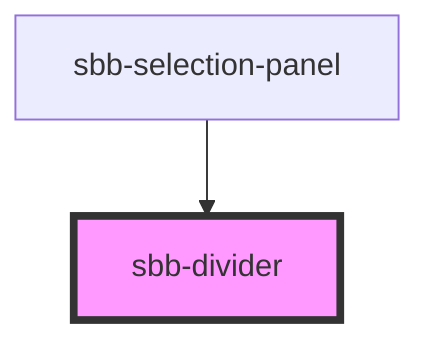

The `sbb-divider` is used to visually divide sections.

Based on the orientation property, the `sbb-divider` can be displayed vertically or horizontally. 

<!-- Auto Generated Below -->

## Properties

| Property      | Attribute     | Description                                                                                   | Type                         | Default        |
| ------------- | ------------- | --------------------------------------------------------------------------------------------- | ---------------------------- | -------------- |
| `negative`    | `negative`    | Negative coloring variant flag                                                                | `boolean`                    | `false`        |
| `orientation` | `orientation` | Orientation property with possible values 'horizontal' \| 'vertical'. Defaults to horizontal. | `"horizontal" \| "vertical"` | `'horizontal'` |

## Dependencies

### Used by

 - [sbb-selection-panel](../sbb-selection-panel)

### Graph

----------------------------------------------

