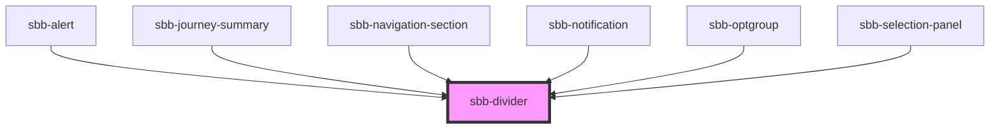

The `sbb-divider` is used to visually divide sections.

### Style 

Based on the `orientation` property, the `sbb-divider` can be displayed vertically or horizontally.

It's also possible to display the component in `negative` variant using the self-named property.

```html
<sbb-divider orientation='vertical'></sbb-divider>

<sbb-divider negative></sbb-divider>
```

<!-- Auto Generated Below -->


## Properties

| Property      | Attribute     | Description                                                                                   | Type                         | Default        |
| ------------- | ------------- | --------------------------------------------------------------------------------------------- | ---------------------------- | -------------- |
| `negative`    | `negative`    | Negative coloring variant flag                                                                | `boolean`                    | `false`        |
| `orientation` | `orientation` | Orientation property with possible values 'horizontal' \| 'vertical'. Defaults to horizontal. | `"horizontal" \| "vertical"` | `'horizontal'` |


## Dependencies

### Used by

 - [sbb-alert](../sbb-alert)
 - [sbb-journey-summary](../sbb-journey-summary)
 - [sbb-navigation-section](../sbb-navigation-section)
 - [sbb-notification](../sbb-notification)
 - [sbb-optgroup](../sbb-optgroup)
 - [sbb-selection-panel](../sbb-selection-panel)

### Graph


----------------------------------------------


