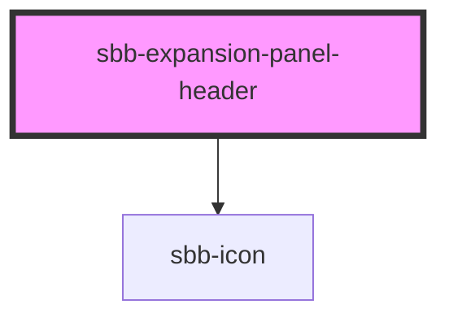

to be documented...

<!-- Auto Generated Below -->

## Properties

| Property   | Attribute   | Description                                                                                                                      | Type      | Default     |
| ---------- | ----------- | -------------------------------------------------------------------------------------------------------------------------------- | --------- | ----------- |
| `disabled` | `disabled`  | Whether the button is disabled .                                                                                                 | `boolean` | `undefined` |
| `expanded` | `expanded`  | Sets the correct toggle icon.                                                                                                    | `boolean` | `undefined` |
| `iconName` | `icon-name` | The icon name we want to use, choose from the small icon variants from the ui-icons category from here https://icons.app.sbb.ch. | `string`  | `undefined` |

## Events

| Event             | Description | Type               |
| ----------------- | ----------- | ------------------ |
| `toggle-expanded` |             | `CustomEvent<any>` |

## Slots

| Slot        | Description                                |
| ----------- | ------------------------------------------ |
| `"icon"`    | Slot used to render the panel header icon. |
| `"unnamed"` | Slot used to render the panel header text. |

## Dependencies

### Depends on

- [sbb-icon](../sbb-icon)

### Graph

----------------------------------------------

