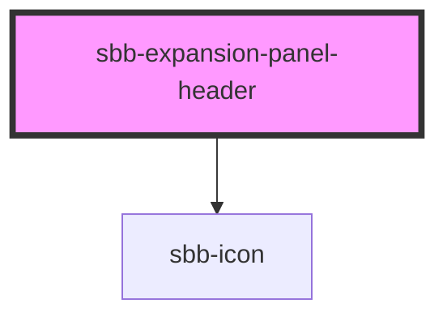

The `sbb-expansion-panel-header` is a component which is meant to be used as a header in the `sbb-expansion-panel`, 
acting as a control for an expanding/collapsing content, like a native `<summary>` tag.

The component is internally rendered as a button, and it can be disabled via the `disabled` property. 
It is possible to provide text via an unnamed slot; the component can optionally display a `<sbb-icon>`
at the component start using the `iconName` property or via custom content using the `icon` slot.
On the left side, a toggle icon is displayed; it flips based on the host's `aria-expanded` property.
When the element is clicked, the `toggle-expanded` event is emitted.

## Usage

Basic:

```html
<sbb-expansion-panel-header>Header</sbb-expansion-panel-header>
```

Disabled header:

```html
<sbb-expansion-panel-header disabled>Header</sbb-expansion-panel-header>
```

Expanded header with icon:

```html
<sbb-expansion-panel-header aria-expanded icon-name='swisspass-medium'>Header</sbb-expansion-panel-header>
```

<!-- Auto Generated Below -->


## Properties

| Property   | Attribute   | Description                                                                                                                      | Type      | Default     |
| ---------- | ----------- | -------------------------------------------------------------------------------------------------------------------------------- | --------- | ----------- |
| `disabled` | `disabled`  | Whether the button is disabled .                                                                                                 | `boolean` | `undefined` |
| `iconName` | `icon-name` | The icon name we want to use, choose from the small icon variants from the ui-icons category from here https://icons.app.sbb.ch. | `string`  | `undefined` |


## Events

| Event             | Description | Type               |
| ----------------- | ----------- | ------------------ |
| `toggle-expanded` |             | `CustomEvent<any>` |


## Slots

| Slot        | Description                                |
| ----------- | ------------------------------------------ |
| `"icon"`    | Slot used to render the panel header icon. |
| `"unnamed"` | Slot used to render the panel header text. |


## Dependencies

### Depends on

- [sbb-icon](../sbb-icon)

### Graph


----------------------------------------------


