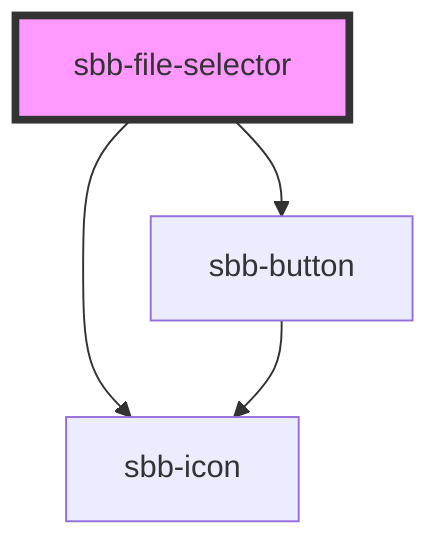

The `sbb-file-selector` is a component which allows user to select one or more files from storage devices.
When files are selected, they appear as a list below the button/dropzone area. 
For each file, the name and the size are displayed and an icon allows for deletion.


### Variants

It has two different display options based on the value of the `variant` property:
by default, a `sbb-button` is displayed, which mimics the native `<input type="file"/>`. 

```html
<sbb-file-selector></sbb-file-selector>
```

Instead, if the `variant` property is set to `dropzone`, the `sbb-button` is shown within a "drag & drop" area. 
In this case, it's possible to customize the area's title via the `titleContent` property. 

```html
<sbb-file-selector variant='dropzone' title-content='Drop file here.'></sbb-file-selector>
```


### Multiple and multipleMode

In both variants, a single file can be selected by default; this can be changed setting the `multiple` property to `true`. 

```html
<sbb-file-selector multiple></sbb-file-selector>
```

The value of the `multipleMode` property determines whether added files should overwrite existing files (`default`) or be appended to them (`persistent`). 

```html
<sbb-file-selector multiple multiple-mode='persistent'></sbb-file-selector>
```


### Accept

The `accept` property can be used to force the user to select one or more specific file types; 
in the next example, only images are allowed.

```html
<sbb-file-selector accept=".png,.jpg,.jpeg"></sbb-file-selector>
```


### Disabled

User interaction can be disabled using the `disabled` property. 

```html
<sbb-file-selector disabled></sbb-file-selector>
```


### Error slot

The `error` named slot can be used to display an error message using the `sbb-form-error` component.

```html
<sbb-file-selector variant='dropzone'>
  <sbb-form-error slot="error">An error occurred during file upload.</sbb-form-error>
</sbb-file-selector>
```


### Events

Whenever the selection changes, a `file-changed` event is fired, whose `event.detail` property contains the list 
of currently selected files. The list can also be retrieved using the `getFiles()` method.

<!-- Auto Generated Below -->


## Properties

| Property       | Attribute       | Description                                                              | Type                        | Default     |
| -------------- | --------------- | ------------------------------------------------------------------------ | --------------------------- | ----------- |
| `accept`       | `accept`        | A comma-separated list of allowed unique file type specifiers.           | `string`                    | `undefined` |
| `disabled`     | `disabled`      | Whether the component is disabled.                                       | `boolean`                   | `undefined` |
| `multiple`     | `multiple`      | Whether more than one file can be selected.                              | `boolean`                   | `undefined` |
| `multipleMode` | `multiple-mode` | Whether the newly added files should override the previously added ones. | `"default" \| "persistent"` | `undefined` |
| `titleContent` | `title-content` | The title displayed in `dropzone` variant.                               | `string`                    | `undefined` |
| `variant`      | `variant`       | Whether the component has a dropzone area or not.                        | `"default" \| "dropzone"`   | `'default'` |


## Events

| Event          | Description                                                | Type                  |
| -------------- | ---------------------------------------------------------- | --------------------- |
| `file-changed` | An event which is emitted each time the file list changes. | `CustomEvent<File[]>` |


## Methods

### `getFiles() => Promise<File[]>`

Gets the currently selected files.

#### Returns

Type: `Promise<File[]>`


## Slots

| Slot      | Description                                                      |
| --------- | ---------------------------------------------------------------- |
| `"error"` | Use this to provide a `sbb-form-error` to show an error message. |


## Dependencies

### Depends on

- [sbb-button](../sbb-button)
- [sbb-icon](../sbb-icon)

### Graph


----------------------------------------------


