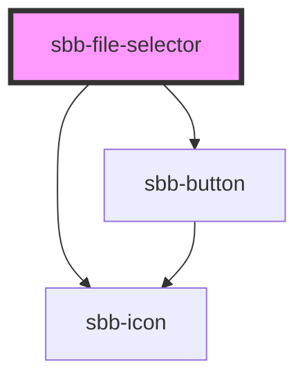

to be documented...

<!-- Auto Generated Below -->

## Properties

| Property       | Attribute       | Description                                                              | Type                        | Default     |
| -------------- | --------------- | ------------------------------------------------------------------------ | --------------------------- | ----------- |
| `accept`       | `accept`        | A comma-separated list of allowed unique file type specifiers.           | `string`                    | `undefined` |
| `disabled`     | `disabled`      | Whether the component is disabled.                                       | `boolean`                   | `undefined` |
| `multiple`     | `multiple`      | Whether more than one file can be selected.                              | `boolean`                   | `undefined` |
| `multipleMode` | `multiple-mode` | Whether the newly added files should override the previously added ones. | `"default" \| "persistent"` | `undefined` |
| `titleContent` | `title-content` | The title displayed in `dropzone` variant.                               | `string`                    | `undefined` |
| `variant`      | `variant`       | Whether the component has a dropzone area or not.                        | `"default" \| "dropzone"`   | `'default'` |

## Events

| Event          | Description                                                | Type                  |
| -------------- | ---------------------------------------------------------- | --------------------- |
| `error`        | An event emitted on error.                                 | `CustomEvent<any>`    |
| `file-changed` | An event which is emitted each time the file list changes. | `CustomEvent<File[]>` |

## Slots

| Slot        | Description                  |
| ----------- | ---------------------------- |
| `"unnamed"` | Use this to document a slot. |

## Dependencies

### Depends on

- [sbb-button](../sbb-button)
- [sbb-icon](../sbb-icon)

### Graph

----------------------------------------------

