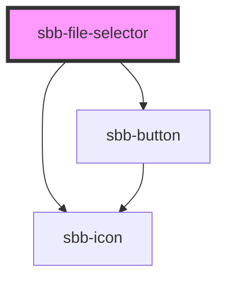

to be documented...

<!-- Auto Generated Below -->

## Properties

| Property       | Attribute       | Description | Type                        | Default     |
| -------------- | --------------- | ----------- | --------------------------- | ----------- |
| `accept`       | `accept`        |             | `string`                    | `undefined` |
| `multiple`     | `multiple`      |             | `boolean`                   | `undefined` |
| `multipleMode` | `multiple-mode` |             | `"default" \| "persistent"` | `undefined` |
| `titleContent` | `title-content` |             | `string`                    | `undefined` |
| `variant`      | `variant`       |             | `"default" \| "dropzone"`   | `'default'` |

## Events

| Event          | Description | Type                  |
| -------------- | ----------- | --------------------- |
| `error`        |             | `CustomEvent<any>`    |
| `file-changed` |             | `CustomEvent<File[]>` |

## Slots

| Slot        | Description                  |
| ----------- | ---------------------------- |
| `"unnamed"` | Use this to document a slot. |

## Dependencies

### Depends on

- [sbb-button](../sbb-button)
- [sbb-icon](../sbb-icon)

### Graph

----------------------------------------------

