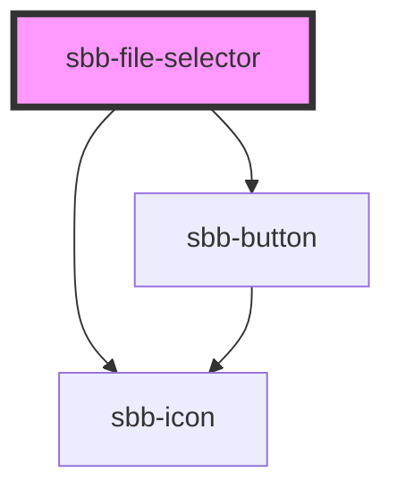

The `sbb-file-selector` is a component which allows user to select one or more files from their storage devices.

It has two different display options based on the value of the `variant` property: by default a `sbb-button` is displayed, 
which mimics the native `<input type="file"/>`. Instead, if the property is set to `dropzone`, the `sbb-button` is shown 
within a "drag & drop" area. In this case, it's possible to customize the area's title via the `titleContent` property. 
In both cases, the user interaction can be disabled using the `disabled` property. The `error` named slot can be used to 
display an error message using the `sbb-form-error` component.

By default, a single file can be selected; this can be changed setting the `multiple` property to `true`. The value of 
the `multipleMode` property determines whether added files should overwrite existing files (`default`) or be appended 
to them (`persistent`). The `accept` property can be used to force the user to select one or more specific file types.

When files are selected, they appear as a list below the button/dropzone area. For each file, the name and the size are 
displayed; an icon allows for deletion. Whenever the selection changes, a `file-changed` event is fired, 
whose `event.detail` property contains the list of currently selected files. Consumers can also listen to the `error` 
event for unhandled exceptions.


## Usage

Default variant, single file selection:

```html
<sbb-file-selector></sbb-file-selector>
```

Default variant, multiple file selection, new files are appended to current selection:

```html
<sbb-file-selector multiple multiple-mode='persistent'></sbb-file-selector>
```

Dropzone variant, single file selection, disabled:

```html
<sbb-file-selector variant='dropzone' disabled></sbb-file-selector>
```

Dropzone variant, multiple file selection with override of current selection, accepts only some image files:

```html
<sbb-file-selector variant='dropzone' multiple accept=".png,.jpg,.jpeg"></sbb-file-selector>
```

Dropzone variant, single file selection with error message:

```html
<sbb-file-selector variant='dropzone' disabled>
  <sbb-form-error slot="error">An error occurred during file upload.</sbb-form-error>
</sbb-file-selector>
```

<!-- Auto Generated Below -->


## Properties

| Property       | Attribute       | Description                                                              | Type                        | Default     |
| -------------- | --------------- | ------------------------------------------------------------------------ | --------------------------- | ----------- |
| `accept`       | `accept`        | A comma-separated list of allowed unique file type specifiers.           | `string`                    | `undefined` |
| `disabled`     | `disabled`      | Whether the component is disabled.                                       | `boolean`                   | `undefined` |
| `multiple`     | `multiple`      | Whether more than one file can be selected.                              | `boolean`                   | `undefined` |
| `multipleMode` | `multiple-mode` | Whether the newly added files should override the previously added ones. | `"default" \| "persistent"` | `undefined` |
| `titleContent` | `title-content` | The title displayed in `dropzone` variant.                               | `string`                    | `undefined` |
| `variant`      | `variant`       | Whether the component has a dropzone area or not.                        | `"default" \| "dropzone"`   | `'default'` |


## Events

| Event          | Description                                                | Type                  |
| -------------- | ---------------------------------------------------------- | --------------------- |
| `error`        | An event emitted on error.                                 | `CustomEvent<any>`    |
| `file-changed` | An event which is emitted each time the file list changes. | `CustomEvent<File[]>` |


## Slots

| Slot      | Description                                                      |
| --------- | ---------------------------------------------------------------- |
| `"error"` | Use this to provide a `sbb-form-error` to show an error message. |


## Dependencies

### Depends on

- [sbb-button](../sbb-button)
- [sbb-icon](../sbb-icon)

### Graph


----------------------------------------------


