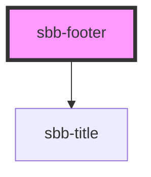

# sbb-footer

<!-- Auto Generated Below -->

## Properties

| Property                          | Attribute             | Description                                                      | Type                           | Default     |
| --------------------------------- | --------------------- | ---------------------------------------------------------------- | ------------------------------ | ----------- |
| `accessibilityTitle` _(required)_ | `accessibility-title` | Footer title text, visually hidden,  necessary for screenreaders | `string`                       | `undefined` |
| `negative`                        | `negative`            | Negative coloring variant flag                                   | `boolean`                      | `undefined` |
| `variant`                         | `variant`             |                                                                  | `"clock-columns" \| "default"` | `'default'` |

## Dependencies

### Depends on

- [sbb-title](../sbb-title)

### Graph

----------------------------------------------

