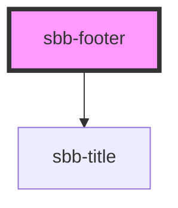

# sbb-footer

The `<sbb-footer>` component is used to display page related informations like for example copyright, contact or other 
content-related-links. There are two variants of the footer. The default, which displays the slotted content in regular 
block element approach and the clock-columns, which used a css-grid for displaying the content over different 
breakpoints.

**Note:** 
Content, like Link-lists that could comes along with a button, needs to be wrapped with a `<div>` element with a helper 
class (`class="sbb-link-list-button-group"`) to be displayed correctly.

## Usage

Default

```html
<sbb-footer accessibility-title="Footer">
  <sbb-link-list title-level="2" title-content="List title text">
    <sbb-link href="#">Link 1</sbb-link>
    <sbb-link href="#">Link 2</sbb-link>
    <sbb-link href="#">Link 3</sbb-link>
    <sbb-link href="#">Link 4</sbb-link>
    <sbb-link href="#">Link 5</sbb-link>
  </sbb-link-list>
</sbb-footer>

```

Variante clock-columns with wrapped link-list with button:

```html
<sbb-footer accessibility-title="Footer" variant="clock-columns">
  <div class="sbb-link-list-button-group">
    <sbb-link-list title-level="2" title-content="Help &amp; Contact.">
      <sbb-link href="#">Refunds</sbb-link>
      <sbb-link href="#">Lost property office</sbb-link>
      <sbb-link href="#">Complaints</sbb-link>
      <sbb-link href="#">Praise</sbb-link>
      <sbb-link href="#">Report property damage</sbb-link>
    </sbb-link-list>
    <sbb-button href="#" variant="primary">All help topics</sbb-button>
  </div>
  <sbb-link-list title-level="2" title-content="More SBB.">
    <sbb-link href="#">Jobs & careers</sbb-link>
    <sbb-link href="#">Rail traffic information</sbb-link>
    <sbb-link href="#">SBB News</sbb-link>
    <sbb-link href="#">SBB Community</sbb-link>
    <sbb-link href="#">Company</sbb-link>
  </sbb-link-list>
  ...
  <sbb-divider class="sbb-divider sbb-divider--horizontal hydrated" role="separator" aria-orientation="horizontal"></sbb-divider>  
  <sbb-link-list horizontal-from="large">
    <sbb-link href="#" text-size="xs">Refunds</sbb-link>
    <sbb-link href="#" text-size="xs">Lost property office</sbb-link>
    <sbb-link href="#" text-size="xs">Complaints</sbb-link>
    <sbb-link href="#" text-size="xs">Praise</sbb-link>
    <sbb-link href="#" text-size="xs">Report property damage</sbb-link>
  </sbb-link-list>

</sbb-footer>
```
<!-- Auto Generated Below -->


## Properties

| Property             | Attribute             | Description                                                                                                                                                                                    | Type                           | Default     |
| -------------------- | --------------------- | ---------------------------------------------------------------------------------------------------------------------------------------------------------------------------------------------- | ------------------------------ | ----------- |
| `accessibilityTitle` | `accessibility-title` | Footer title text, visually hidden,  necessary for screenreaders                                                                                                                               | `string`                       | `undefined` |
| `negative`           | `negative`            | Negative coloring variant flag                                                                                                                                                                 | `boolean`                      | `false`     |
| `variant`            | `variant`             | Variants to display the footer. The default, displays the content in regular block element approach. The clock-columns, used a css-grid for displaying the content over different breakpoints. | `"clock-columns" \| "default"` | `'default'` |


## Dependencies

### Depends on

- [sbb-title](../sbb-title)

### Graph


----------------------------------------------


