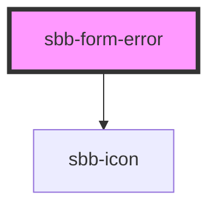

# sbb-form-error

The `sbb-form-error` component provides an additional message inside the `sbb-form-field` component.

## Usage

The example below shows how the component is used:

```html
<!-- Will use "sbb" as the default namespace -->
<sbb-form-error>This field is required!</sbb-form-error>
```


<!-- Auto Generated Below -->


## Properties

| Property     | Attribute     | Description                                           | Type                     | Default     |
| ------------ | ------------- | ----------------------------------------------------- | ------------------------ | ----------- |
| `errorSpace` | `error-space` | Add a specific space if the `<sbb-error>` is present. | `"default" \| "reserve"` | `'default'` |


## Dependencies

### Depends on

- [sbb-icon](../sbb-icon)

### Graph


----------------------------------------------


