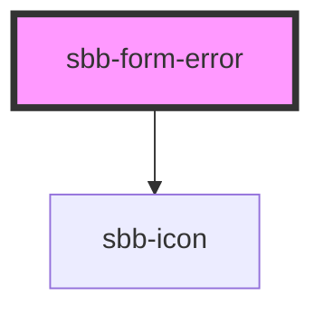

# sbb-form-error

<!-- Auto Generated Below -->

## Properties

| Property     | Attribute     | Description                                           | Type                     | Default     |
| ------------ | ------------- | ----------------------------------------------------- | ------------------------ | ----------- |
| `errorSpace` | `error-space` | Add a specific space if the `<sbb-error>` is present. | `"default" \| "reserve"` | `'default'` |

## Dependencies

### Depends on

- [sbb-icon](../sbb-icon)

### Graph

----------------------------------------------

