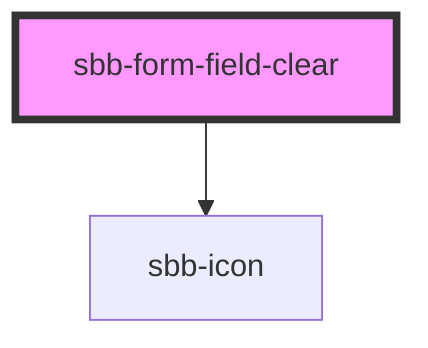

The `sbb-form-field-clear` component can be used with the `sbb-form-field` component to provide the possibility to display a clear button which can clear the input value.

## Usage

It currently works with simple inputs and does not support, for example, `select` inputs:

```html
<sbb-form-field label="Label">
  <input type="text" placeholder="Input placeholder" value="Input value" />
  <sbb-form-field-clear />
</sbb-form-field>
```

<!-- Auto Generated Below -->


## Slots

| Slot        | Description                 |
| ----------- | --------------------------- |
| `"unnamed"` | Slot to render the content. |


## Dependencies

### Depends on

- [sbb-icon](../sbb-icon)

### Graph


----------------------------------------------


