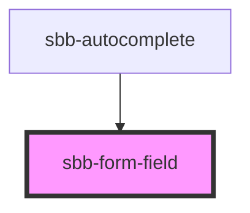

# sbb-form-field

The `sbb-form-field` component provides a way of rendering a form input wrapper with label and errors.

## Usage

The examples below show how to render the component:

```html
<sbb-form-field>
  <input slot="input" />
</sbb-form-field>


<sbb-form-field>
  <span slot="label">Input Label</span>
  <input slot="input" />
  <sbb-form-error>This field is required!</sbb-form-error>
</sbb-form-field>
```

## Accessibility

By itself, `<sbb-form-field>` does not apply any additional accessibility treatment to a form element. However, several of the form field's optional features interact with the form element contained within the form field.

When you provide a label via `label` attribute or `slot="label"`, `<sbb-form-field>` automatically associates this label with the field's form element via a native <label> element, using the for attribute to reference the control's ID.

When you provide informational text via `<sbb-form-error>`, `<sbb-form-error>` automatically adds these elements' IDs to the form element's aria-describedby attribute. Additionally, `<sbb-form-error>` applies aria-live="polite" by default such that assistive technology will announce errors when they appear.

<!-- Auto Generated Below -->


## Properties

| Property     | Attribute     | Description                                                                                                                               | Type                     | Default     |
| ------------ | ------------- | ----------------------------------------------------------------------------------------------------------------------------------------- | ------------------------ | ----------- |
| `borderless` | `borderless`  | Whether to display the form field without a border.                                                                                       | `boolean`                | `false`     |
| `errorSpace` | `error-space` | Whether to reserve space for an error message. `default` does not reserve any space. `reserve` does reserve one row for an error message. | `"default" \| "reserve"` | `'default'` |
| `label`      | `label`       | Label text for the input which is internally rendered as `<label>`.                                                                       | `string`                 | `undefined` |
| `optional`   | `optional`    | Indicates whether the input is optional.                                                                                                  | `boolean`                | `undefined` |
| `size`       | `size`        | Size variant, either l or m.                                                                                                              | `"l" \| "m"`             | `'m'`       |


## Slots

| Slot        | Description                                            |
| ----------- | ------------------------------------------------------ |
| `"error"`   | Slot to render an error.                               |
| `"label"`   | Slot to render a label.                                |
| `"prefix"`  | Slot to render an icon at the left side of the input.  |
| `"suffix"`  | Slot to render an icon at the right side of the input. |
| `"unnamed"` | Slot to render an input/select.                        |


## Dependencies

### Used by

 - [sbb-autocomplete](../sbb-autocomplete)

### Graph


----------------------------------------------


