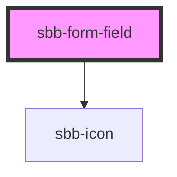

`<sbb-form-field>` is intended to be used as a form input wrapper with label and errors.

In this document, "form field" refers to the wrapper component `<sbb-form-field>` and
"form field control" refers to the component that the `<sbb-form-field>` is wrapping
(e.g. the input, select, etc.)

The following components are designed to work inside a `<sbb-form-field>`:

- `<input>`
- `<select>`
- `<sbb-datepicker>`
- `<sbb-select>`
- `<sbb-slider>`
- `<sbb-time-input>`

## Usage

The examples below show how to render the component:

```html
<sbb-form-field label="Example">
  <input />
</sbb-form-field>


<sbb-form-field>
  <label>Example</label>
  <input />
  <sbb-form-error>This field is required!</sbb-form-error>
</sbb-form-field>
```

### Label

Either use a `<label>` or the `label` attribute to provide a label for a form input. The
`<sbb-form-field>` will automatically assign the correct id reference between label and input.

When using the floating label and setting the value programmatically to empty or from empty to a specific value,
it's mandatory to call the `reset()` method of the `sbb-form-field` to update the state of the floating label.

### Error messages

Error messages can be shown under the form field by adding `sbb-form-error` elements inside the
form field.

#### Reserve error space

In order to avoid the layout from "jumping" when an error is shown, the option of setting
`error-space="reserve"` on the `<sbb-form-field>` will reserve space for a single line of an error
message.

### Prefix & Suffix

It is possible to add content as a prefix or suffix in a `<sbb-form-field>`. This can be done via
the `prefix` and `suffix` slots. 

```html
<sbb-form-field label="Example">
  <sbb-icon slot="prefix" name="pie-small" />
  <input />
  <sbb-icon slot="suffix" name="circle-information-small" />
</sbb-form-field>
```

### Width

By default, the component has a defined width and min-width. However, this behavior can be overridden by setting 
the `width` property to `collapse`: in this way the component adapts its width to the inner slotted input component.
This is useful, for example, for the `sbb-time-input` component. However, as the width-styles are exposed to the host, 
it's possible to apply any desired width by setting just the `width` and `min-width` CSS properties.

## Accessibility

By itself, `<sbb-form-field>` does not apply any additional accessibility treatment to a form
element. However, several of the form field's optional features interact with the form element
contained within the form field.

When you provide a label via `<label>` or the `label` attribute, `<sbb-form-field>` automatically
associates this label with the field's form element via a native `<label>` element, using the `for`
attribute to reference the control's ID.
When using a non-native form element (e.g. `<sbb-select>`) `aria-labelledby` is used, to connect the
form element with the label, by setting an id on the label and referencing this id in the
`aria-labelledby` attribute placed on the form element.
Please note that only one `<label>` element is supported. Additionally, if you place the `<label>`
element outside the `<sbb-form-field>`, the automatic assignment is skipped, and it is up to the
consumer to use the correct id references.

When you provide informational text via `<sbb-form-error>`, `<sbb-form-error>` automatically adds
these elements' IDs to the form element's aria-describedby attribute. Additionally, 
`<sbb-form-error>` is slotted to an element having `aria-live="polite"` so that assistive
technology will announce errors when they appear.

<!-- Auto Generated Below -->


## Properties

| Property        | Attribute        | Description                                                                                                                                                           | Type                      | Default     |
| --------------- | ---------------- | --------------------------------------------------------------------------------------------------------------------------------------------------------------------- | ------------------------- | ----------- |
| `borderless`    | `borderless`     | Whether to display the form field without a border.                                                                                                                   | `boolean`                 | `false`     |
| `errorSpace`    | `error-space`    | Whether to reserve space for an error message. `none` does not reserve any space. `reserve` does reserve one row for an error message.                                | `"none" \| "reserve"`     | `'none'`    |
| `floatingLabel` | `floating-label` | Whether the label should float. If activated, the placeholder of the input is hidden.                                                                                 | `boolean`                 | `false`     |
| `label`         | `label`          | Label text for the input which is internally rendered as `<label>`.                                                                                                   | `string`                  | `undefined` |
| `negative`      | `negative`       | Negative coloring variant flag.                                                                                                                                       | `boolean`                 | `false`     |
| `optional`      | `optional`       | Indicates whether the input is optional.                                                                                                                              | `boolean`                 | `undefined` |
| `size`          | `size`           | Size variant, either l or m.                                                                                                                                          | `"l" \| "m"`              | `'m'`       |
| `width`         | `width`          | Defines the width of the component: - `default`: the component has defined width and min-width; - `collapse`: the component adapts itself to its inner input content. | `"collapse" \| "default"` | `'default'` |


## Methods

### `clear() => Promise<void>`

Manually clears the input value. It only works for inputs, selects are not supported.

#### Returns

Type: `Promise<void>`


### `getInputElement() => Promise<HTMLInputElement | HTMLSelectElement | HTMLElement>`

Returns the input element.

#### Returns

Type: `Promise<HTMLElement | HTMLInputElement | HTMLSelectElement>`


### `reset() => Promise<void>`

Manually reset the form field. Currently, this only resets the floating label.

#### Returns

Type: `Promise<void>`


## Slots

| Slot        | Description                                            |
| ----------- | ------------------------------------------------------ |
| `"error"`   | Slot to render an error.                               |
| `"label"`   | Slot to render a label.                                |
| `"prefix"`  | Slot to render an icon on the left side of the input.  |
| `"suffix"`  | Slot to render an icon on the right side of the input. |
| `"unnamed"` | Slot to render an input/select.                        |


## Dependencies

### Depends on

- [sbb-icon](../sbb-icon)

### Graph


----------------------------------------------


