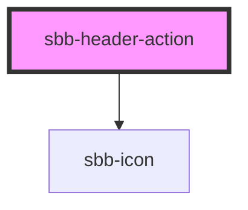

# **name**

<!-- Auto Generated Below -->

## Properties

| Property                   | Attribute                   | Description                                                                                 | Type                                                                       | Default                           |
| -------------------------- | --------------------------- | ------------------------------------------------------------------------------------------- | -------------------------------------------------------------------------- | --------------------------------- |
| `accessibilityDescribedby` | `accessibility-describedby` | This will be forwarded as aria-describedby to the relevant nested element.                  | `string`                                                                   | `undefined`                       |
| `accessibilityLabel`       | `accessibility-label`       | This will be forwarded as aria-label to the relevant nested element.                        | `string`                                                                   | `undefined`                       |
| `accessibilityLabelledby`  | `accessibility-labelledby`  | This will be forwarded as aria-labelledby to the relevant nested element.                   | `string`                                                                   | `undefined`                       |
| `actionHeaderId`           | `action-header-id`          |                                                                                             | `string`                                                                   | ``sbb-action-header.${++nextId}`` |
| `disabled`                 | `disabled`                  | Whether the button is disabled.                                                             | `boolean`                                                                  | `undefined`                       |
| `download`                 | `download`                  | Whether the browser will show the download dialog on click.                                 | `boolean`                                                                  | `undefined`                       |
| `eventId`                  | `event-id`                  | Id sent in the click event payload. TODO verify if needed and if string is the correct type | `string`                                                                   | `undefined`                       |
| `expandFrom`               | `expand-from`               |                                                                                             | `"large" \| "medium" \| "micro" \| "small" \| "ultra" \| "wide" \| "zero"` | `'medium'`                        |
| `form`                     | `form`                      | The <form> element to associate the button with.                                            | `string`                                                                   | `undefined`                       |
| `href`                     | `href`                      | The href value you want to link to.                                                         | `string`                                                                   | `undefined`                       |
| `icon`                     | `icon`                      |                                                                                             | `string`                                                                   | `undefined`                       |
| `name`                     | `name`                      | The name of the button.                                                                     | `string`                                                                   | `undefined`                       |
| `type`                     | `type`                      | Default behaviour of the button.                                                            | `"button" \| "reset" \| "submit"`                                          | `undefined`                       |

## Events

| Event                            | Description                                                                                               | Type               |
| -------------------------------- | --------------------------------------------------------------------------------------------------------- | ------------------ |
| `sbb-header-action-button_click` | Emits the eventId to parent on button click. TODO check if it's possible to use a better type than 'any'. | `CustomEvent<any>` |

## Slots

| Slot        | Description                          |
| ----------- | ------------------------------------ |
| `"icon"`    | Slot used to render the action icon  |
| `"unnamed"` | Slot used to render the action label |

## Dependencies

### Depends on

- [sbb-icon](../sbb-icon)

### Graph

----------------------------------------------

