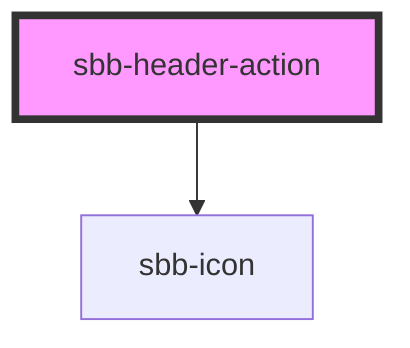

# **name**

<!-- Auto Generated Below -->

## Properties

| Property           | Attribute             | Description | Type                                                                       | Default     |
| ------------------ | --------------------- | ----------- | -------------------------------------------------------------------------- | ----------- |
| `expandFrom`       | `expand-from`         |             | `"large" \| "medium" \| "micro" \| "small" \| "ultra" \| "wide" \| "zero"` | `'medium'`  |
| `icon`             | `icon`                |             | `string`                                                                   | `undefined` |
| `isAnchorOrButton` | `is-anchor-or-button` |             | `boolean`                                                                  | `undefined` |

## Slots

| Slot        | Description                  |
| ----------- | ---------------------------- |
| `"unnamed"` | Use this to document a slot. |

## Dependencies

### Depends on

- [sbb-icon](../sbb-icon)

### Graph

----------------------------------------------

