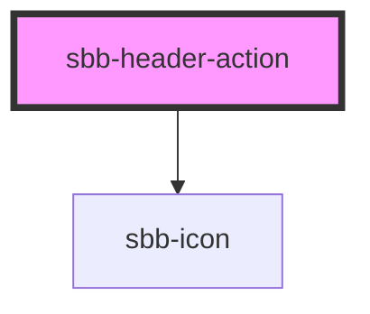

# sbb-header-action

The component represents an action element contained by the [sbb-header](../sbb-header/readme.md) component.

As the [sbb-link](../sbb-link/readme.md), it can be internally rendered as a button or as a link.
Consumers can set the icon and the label; the property `expandFrom` defined the minimum breakpoint 
from which the label is displayed.

<!-- Auto Generated Below -->

## Properties

| Property                   | Attribute                   | Description                                                                                                                                                                            | Type                                                                       | Default                           |
| -------------------------- | --------------------------- | -------------------------------------------------------------------------------------------------------------------------------------------------------------------------------------- | -------------------------------------------------------------------------- | --------------------------------- |
| `accessibilityDescribedby` | `accessibility-describedby` | This will be forwarded as aria-describedby to the relevant nested element.                                                                                                             | `string`                                                                   | `undefined`                       |
| `accessibilityLabel`       | `accessibility-label`       | This will be forwarded as aria-label to the relevant nested element.                                                                                                                   | `string`                                                                   | `undefined`                       |
| `accessibilityLabelledby`  | `accessibility-labelledby`  | This will be forwarded as aria-labelledby to the relevant nested element.                                                                                                              | `string`                                                                   | `undefined`                       |
| `actionHeaderId`           | `action-header-id`          | Id of the action element.                                                                                                                                                              | `string`                                                                   | ``sbb-action-header-${++nextId}`` |
| `download`                 | `download`                  | Indicates whether the browser will show the download dialog on click.                                                                                                                  | `boolean`                                                                  | `undefined`                       |
| `eventId`                  | `event-id`                  | Id sent in the click event payload                                                                                                                                                     | `string`                                                                   | `undefined`                       |
| `expandFrom`               | `expand-from`               | Used to set the minimum breakpoint from which the text is displayed. Eg. if set to 'large', the text will be visible for breakpoints large, wide, ultra, and hidden for all the other. | `"large" \| "medium" \| "micro" \| "small" \| "ultra" \| "wide" \| "zero"` | `'medium'`                        |
| `form`                     | `form`                      | Form attribute if component is displayed as a button.                                                                                                                                  | `string`                                                                   | `undefined`                       |
| `href`                     | `href`                      | The href value you want to link to.                                                                                                                                                    | `string`                                                                   | `undefined`                       |
| `icon`                     | `icon`                      | The icon name used in the element. See sbb-icon components for more details.                                                                                                           | `string`                                                                   | `undefined`                       |
| `name`                     | `name`                      | Name attribute if component is displayed as a button.                                                                                                                                  | `string`                                                                   | `undefined`                       |
| `rel`                      | `rel`                       | The relationship of the linked URL as space-separated link types.                                                                                                                      | `string`                                                                   | `undefined`                       |
| `target`                   | `target`                    | Where to display the linked URL.                                                                                                                                                       | `string`                                                                   | `undefined`                       |
| `type`                     | `type`                      | Type attribute if component is displayed as a button.                                                                                                                                  | `"button" \| "reset" \| "submit"`                                          | `undefined`                       |
| `value`                    | `value`                     | The value associated with button `name` when it's submitted with the form data.                                                                                                        | `string`                                                                   | `undefined`                       |

## Events

| Event                            | Description                                            | Type                  |
| -------------------------------- | ------------------------------------------------------ | --------------------- |
| `sbb-header-action-button_click` | Emits whenever the native button click event triggers. | `CustomEvent<string>` |

## Slots

| Slot        | Description                          |
| ----------- | ------------------------------------ |
| `"icon"`    | Slot used to render the action icon  |
| `"unnamed"` | Slot used to render the action label |

## Dependencies

### Depends on

- [sbb-icon](../sbb-icon)

### Graph

----------------------------------------------

