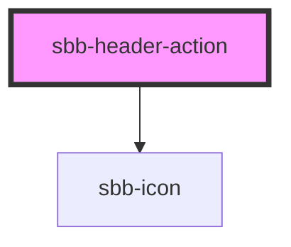

The component represents an action element contained by the [sbb-header](/docs/components-sbb-header-sbb-header--docs) component.

## Slots

It is possible to provide a label via an unnamed slot; the component can optionally display a `sbb-icon`
at the component start using the `iconName` property or via custom content using the `icon` slot. 

```html
<sbb-header-action>Text</sbb-header-action>

<sbb-header-action icon-name='pie-small'>Another text</sbb-header-action>
```

If the component's icon is set, the property `expandFrom` can be used to define the minimum breakpoint 
from which the label is displayed; below that, only the icon is visible.

```html
<sbb-header-action expand-from='medium'>Text</sbb-header-action>
```

## Link / button properties

As the [sbb-link](/docs/components-sbb-link--docs) and the [sbb-button](/docs/components-sbb-button--docs),
the component can be internally rendered as a button or as a link,
depending on the value of the `href` property, so the associated properties are available
(`href`, `target`, `rel` and `download` for link; `type`, `name`, `value` and `form` for button).

```html
<sbb-header-action href="#info" target='_blank'>Link</sbb-header-action>

<sbb-header-action type='button' value='menu' name='menu'>Button</sbb-header-action>
```

<!-- Auto Generated Below -->


## Properties

| Property     | Attribute     | Description                                                                                                                                                                              | Type                                                                       | Default     |
| ------------ | ------------- | ---------------------------------------------------------------------------------------------------------------------------------------------------------------------------------------- | -------------------------------------------------------------------------- | ----------- |
| `download`   | `download`    | Whether the browser will show the download dialog on click.                                                                                                                              | `boolean`                                                                  | `undefined` |
| `expandFrom` | `expand-from` | Used to set the minimum breakpoint from which the text is displayed. E.g. if set to 'large', the text will be visible for breakpoints large, wide, ultra, and hidden for all the others. | `"large" \| "medium" \| "micro" \| "small" \| "ultra" \| "wide" \| "zero"` | `'medium'`  |
| `form`       | `form`        | Form attribute if component is displayed as a button.                                                                                                                                    | `string`                                                                   | `undefined` |
| `href`       | `href`        | The href value you want to link to (if it is not present sbb-header-action becomes a button).                                                                                            | `string`                                                                   | `undefined` |
| `iconName`   | `icon-name`   | The icon name we want to use, choose from the small icon variants from the ui-icons category from here https://icons.app.sbb.ch.                                                         | `string`                                                                   | `undefined` |
| `name`       | `name`        | Name attribute if component is displayed as a button.                                                                                                                                    | `string`                                                                   | `undefined` |
| `rel`        | `rel`         | The relationship of the linked URL as space-separated link types.                                                                                                                        | `string`                                                                   | `undefined` |
| `target`     | `target`      | Where to display the linked URL.                                                                                                                                                         | `string`                                                                   | `undefined` |
| `type`       | `type`        | Type attribute if component is displayed as a button.                                                                                                                                    | `"button" \| "reset" \| "submit"`                                          | `undefined` |
| `value`      | `value`       | The value associated with button `name` when it's submitted with the form data.                                                                                                          | `string`                                                                   | `undefined` |


## Slots

| Slot        | Description                          |
| ----------- | ------------------------------------ |
| `"icon"`    | Slot used to render the action icon. |
| `"unnamed"` | Slot used to render the action text. |


## Dependencies

### Depends on

- [sbb-icon](../sbb-icon)

### Graph


----------------------------------------------


