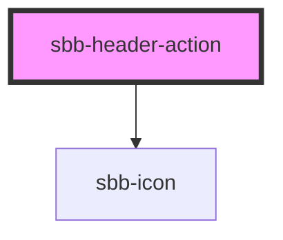

The component represents an action element contained by the [sbb-header](../sbb-header/readme.md) component.

As the [sbb-link](../sbb-link/readme.md), it can be internally rendered as a button or as a link.
Consumers can set the icon and the label; the property `expandFrom` defines the minimum breakpoint 
from which the label is displayed.

## Usage
Simple button

```html
<sbb-header-action>Button text</sbb-header-action>
```

Simple link

```html
<sbb-header-action href="#info">Link text</sbb-header-action>
```


<!-- Auto Generated Below -->


## Properties

| Property     | Attribute     | Description                                                                                                                                                                              | Type                                                                       | Default     |
| ------------ | ------------- | ---------------------------------------------------------------------------------------------------------------------------------------------------------------------------------------- | -------------------------------------------------------------------------- | ----------- |
| `download`   | `download`    | Whether the browser will show the download dialog on click.                                                                                                                              | `boolean`                                                                  | `undefined` |
| `expandFrom` | `expand-from` | Used to set the minimum breakpoint from which the text is displayed. E.g. if set to 'large', the text will be visible for breakpoints large, wide, ultra, and hidden for all the others. | `"large" \| "medium" \| "micro" \| "small" \| "ultra" \| "wide" \| "zero"` | `'medium'`  |
| `form`       | `form`        | Form attribute if component is displayed as a button.                                                                                                                                    | `string`                                                                   | `undefined` |
| `href`       | `href`        | The href value you want to link to (if it is not present sbb-header-action becomes a button).                                                                                            | `string`                                                                   | `undefined` |
| `iconName`   | `icon-name`   | The icon name we want to use, choose from the small icon variants from the ui-icons category from here https://icons.app.sbb.ch.                                                         | `string`                                                                   | `undefined` |
| `name`       | `name`        | Name attribute if component is displayed as a button.                                                                                                                                    | `string`                                                                   | `undefined` |
| `rel`        | `rel`         | The relationship of the linked URL as space-separated link types.                                                                                                                        | `string`                                                                   | `undefined` |
| `target`     | `target`      | Where to display the linked URL.                                                                                                                                                         | `string`                                                                   | `undefined` |
| `type`       | `type`        | Type attribute if component is displayed as a button.                                                                                                                                    | `"button" \| "reset" \| "submit"`                                          | `undefined` |
| `value`      | `value`       | The value associated with button `name` when it's submitted with the form data.                                                                                                          | `string`                                                                   | `undefined` |


## Slots

| Slot        | Description                          |
| ----------- | ------------------------------------ |
| `"icon"`    | Slot used to render the action icon. |
| `"unnamed"` | Slot used to render the action text. |


## Dependencies

### Depends on

- [sbb-icon](../sbb-icon)

### Graph


----------------------------------------------


