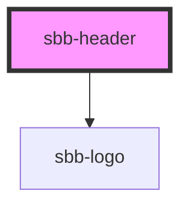

# sbb-header

The `sbb-header` component is a container for actions and logo, and it is displayed sticky at page's top.

It has two slots: 
the first one can contain one or more [sbb-header-action](../sbb-header-action/readme.md) or other action items
like `sbb-button` or `sbb-link`, and it is displayed at the left end of the component; the second slot is displayed
at the right end, and it can contain a logo, which by default is the [sbb-logo](../sbb-logo/readme.md).

A box-shadow appears under the component if the `shadow` variable is set to `true`. 

The component's height can be overriden by defining the variable `--sbb-header-height-override`.

A custom CSS can be obtained adding the `sbb-header__alternative` class on the component. 

## Usage

The examples below shows how to use the component (with shadow on).

```html
<sbb-header shadow="true">
  <sbb-header-action
    icon="hamburger-menu-small"
    href="https://lyne-icons.netlify.app/icons/hamburger-menu-small.svg"
    target="_blank"
  >
    Menu
  </sbb-header-action>,
  <sbb-header-action icon="magnifying-glass-small">Suchen</sbb-header-action>,
</sbb-header>
```

<!-- Auto Generated Below -->


## Properties

| Property | Attribute | Description                                                                            | Type      | Default     |
| -------- | --------- | -------------------------------------------------------------------------------------- | --------- | ----------- |
| `shadow` | `shadow`  | Used to display a box-shadow below the component on y-axis scroll whether set to true. | `boolean` | `undefined` |


## Slots

| Slot        | Description                                                           |
| ----------- | --------------------------------------------------------------------- |
| `"logo"`    | Slot used to render the logo on the right side (sbb-logo as default). |
| `"unnamed"` | Slot used to render the actions on the left side.                     |


## Dependencies

### Depends on

- [sbb-logo](../sbb-logo)

### Graph


----------------------------------------------


