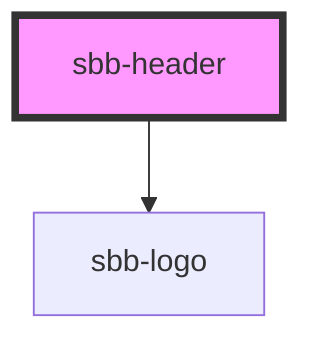

# **name**

<!-- Auto Generated Below -->

## Properties

| Property | Attribute | Description | Type      | Default     |
| -------- | --------- | ----------- | --------- | ----------- |
| `shadow` | `shadow`  |             | `boolean` | `undefined` |

## Slots

| Slot        | Description                  |
| ----------- | ---------------------------- |
| `"unnamed"` | Use this to document a slot. |

## Dependencies

### Depends on

- [sbb-logo](../sbb-logo)

### Graph

----------------------------------------------

