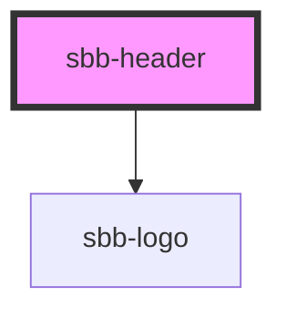

The `sbb-header` component is a container for actions and a logo, and it is displayed at the top of the page.

It has two slots: 
the first one can contain one or more [sbb-header-action](../sbb-header-action/readme.md) or other action items
like `sbb-button` or `sbb-link`, and it is displayed at the left end of the component; the second slot is displayed
at the right end, and it can contain a logo, which by default is the [sbb-logo](../sbb-logo/readme.md).

The height of the header can be overridden by re-defining the css variable `--sbb-header-height`.

By default, the `sbb-header` has a fixed position at the top of the page; 
when the page is scrolled down, a box-shadow appears below it and the component remains visible.
It's possible to change this behavior by setting the `hideOnScroll` property to `true`, or adding the `hide-on-scroll`
attribute: in this case, the box-shadow is still set, but the component disappears when the page is scrolled down and 
then reappears as soon as it's scrolled up. It's also possible to bind this behaviour to something other than the `document`, 
using the `scrollOrigin` property, which accepts an `HTMLElement` or the id of the element to search for.

To avoid that tabbed/focused elements get hidden behind the header, it's recommended to set the CSS property `scroll-padding-top` 
of the `<html>` tag to `var(--sbb-header-height)` or a greater value. With this it's ensured that content 
will be visible all the time.

## Style

The default `z-index` of the component is set to `10`; to specify a custom stack order, the `z-index` can
be changed by defining the CSS variable `--sbb-header-z-index`.

Users can customize position and behaviour of actions inside the `sbb-header` component 
by adding classes to `sbb-header-action` elements and then defining their own style rules.

An example has been created with the following requirements:
- 4 action item (with custom icons);
- the first item is always left aligned and has `expand-from` set to `small`;
- the other 3 items are left aligned in breakpoints zero to medium, and right aligned from large to ultra;
- the last item is not visible in breakpoints zero to small.

To achieve this result, a `div` tag with a class named `spacer` was added between the first 
and the second `sbb-header-action` item, then a class named `last-element` was added to the last one.
Finally, the following custom CSS has been added*. The result can be seen in the home and home--logged-in stories.

```css
.spacer {
  display: none;
}

.last-element {
  display: none;
}

@media screen and (min-width: 840px) {
  .last-element {
    display: block;
  }
}

@media screen and (min-width: 1024px) {
  .spacer {
    display: flex;
    flex-grow: 1;
  }

  .last-element {
    margin-inline-end: var(--sbb-spacing-responsive-s);
  }
}
```

*Technical note: Due the presence of media-query rules, it was not possible to add those rules directly 
in the component's stories (see also [this Storybook issue](https://github.com/storybookjs/storybook/issues/8820)),
so they were wrapped into a `style` tag and added to the Storybook's configuration file named `preview-head.html`.

## Usage

The examples below shows how to use the component (with shadow on).

```html
<sbb-header shadow="true">
  <sbb-header-action
    icon-name="hamburger-menu-small"
    href="https://sbb.ch/somewhere"
    target="_blank"
  >
    Menu
  </sbb-header-action>
  <sbb-header-action icon-name="magnifying-glass-small">Search</sbb-header-action>
</sbb-header>
```

Header with logo link and slotted sbb-logo:

```html
<sbb-header shadow="true">
  <sbb-header-action icon-name="magnifying-glass-small">Search</sbb-header-action>
  <a href="https://www.sbb.ch" slot="logo">
    <sbb-logo protective-room="none"></sbb-logo>
  </a>
</sbb-header>
```

<!-- Auto Generated Below -->


## Properties

| Property       | Attribute        | Description                                                                                                          | Type                                | Default    |
| -------------- | ---------------- | -------------------------------------------------------------------------------------------------------------------- | ----------------------------------- | ---------- |
| `expanded`     | `expanded`       | Whether to allow the header content to stretch to full width. By default, the content has the appropriate page size. | `boolean`                           | `false`    |
| `hideOnScroll` | `hide-on-scroll` | Whether the header should hide and show on scroll.                                                                   | `boolean`                           | `false`    |
| `scrollOrigin` | `scroll-origin`  | The element's id or the element on which the scroll listener is attached.                                            | `Document \| HTMLElement \| string` | `document` |


## Slots

| Slot        | Description                                                           |
| ----------- | --------------------------------------------------------------------- |
| `"logo"`    | Slot used to render the logo on the right side (sbb-logo as default). |
| `"unnamed"` | Slot used to render the actions on the left side.                     |


## Dependencies

### Depends on

- [sbb-logo](../sbb-logo)

### Graph


----------------------------------------------


