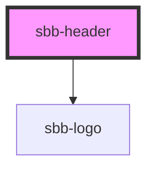

# sbb-header

The component represents the Lyne header; it is meant to be used as a container for the logo on the right side
(the default one is the [sbb-logo](../sbb-logo/readme.md)) and [sbb-header-action](../sbb-header-action/readme.md)s
on the left side (like menu, search and so on).

<!-- Auto Generated Below -->

## Properties

| Property | Attribute | Description                                                                            | Type      | Default     |
| -------- | --------- | -------------------------------------------------------------------------------------- | --------- | ----------- |
| `shadow` | `shadow`  | Used to display a box-shadow below the component on y-axis scroll whether set to true. | `boolean` | `undefined` |

## Slots

| Slot        | Description                                                           |
| ----------- | --------------------------------------------------------------------- |
| `"logo"`    | Slot used to render the logo on the right side (sbb-logo as default). |
| `"unnamed"` | Slot used to render the actions on the left side.                     |

## Dependencies

### Depends on

- [sbb-logo](../sbb-logo)

### Graph

----------------------------------------------

