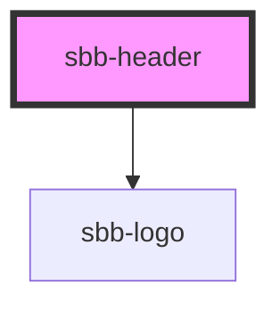

# sbb-header

The `sbb-header` component is a container for actions and logo, and it is displayed sticky at page's top.

It has two slots: 
the first one can contain one or more [sbb-header-action](../sbb-header-action/readme.md) or other action items
like `sbb-button` or `sbb-link`, and it is displayed at the left end of the component; the second slot is displayed
at the right end, and it can contain a logo, which by default is the [sbb-logo](../sbb-logo/readme.md).

The component's height can be overridden by defining the variable `--sbb-header-height-override`.

A box-shadow appears under the component if the `shadow` variable is set to `true`;
consumers could provide their own logic to set this variable to `true` when the page scrolls down,
and to `false` when the scroll is at page's top.
To achieve this in Storybook, these lines have been added in the configuration file called `preview-head.html`:
```javascript
<script>
  const headerScrollHandler = () => {
    const header = document.getElementsByTagName('sbb-header')[0];
    if (header) {
      if (window.scrollY === 0) {
        header.removeAttribute('shadow');
      } else {
        header.setAttribute('shadow', '');
      }
    }
  };
  window.onload = () => document.addEventListener('scroll', headerScrollHandler);
  window.onunload = () => document.removeEventListener('scroll', headerScrollHandler);
</script>
```

## Style

Users can customize position and behaviour of actions inside the `sbb-header` component 
by adding classes to `sbb-header-action` elements and then defining their own style rules.

An example has been created with the following requirements:
- 4 action item (with custom icons);
- the first item is always left aligned and has `expand-from` set to `small`;
- the other 3 items are left aligned in breakpoints zero to medium, and right aligned from large to ultra;
- the last item is not visible in breakpoints zero to small.

To achieve this result, a `div` tag with a class named `spacer` was added between the first 
and the second `sbb-header-action` item, then a class named `last-element` was added to the last one.
Finally, the following custom CSS has been added*. The result can be seen in the home and home--logged-in stories.

```css
.spacer {
  display: none;
}

.last-element {
  display: none;
}

@media screen and (min-width: 840px) {
  .last-element {
    display: block;
  }
}

@media screen and (min-width: 1024px) {
  .spacer {
    display: flex;
    flex-grow: 1;
  }

  .last-element {
    margin-inline-end: var(--sbb-spacing-responsive-s);
  }
}
```

*Technical note: Due the presence of media-query rules, it was not possible to add those rules directly 
in the component's stories (see also [this Storybook issue](https://github.com/storybookjs/storybook/issues/8820)),
so they were wrapped into a `style` tag and added to the Storybook's configuration file named `preview-head.html`.

## Usage

The examples below shows how to use the component (with shadow on).

```html
<sbb-header shadow="true">
  <sbb-header-action
    icon="hamburger-menu-small"
    href="https://lyne-icons.netlify.app/icons/hamburger-menu-small.svg"
    target="_blank"
  >
    Menu
  </sbb-header-action>,
  <sbb-header-action icon="magnifying-glass-small">Search</sbb-header-action>,
</sbb-header>
```

<!-- Auto Generated Below -->


## Properties

| Property | Attribute | Description                                                                            | Type      | Default     |
| -------- | --------- | -------------------------------------------------------------------------------------- | --------- | ----------- |
| `shadow` | `shadow`  | Used to display a box-shadow below the component on y-axis scroll whether set to true. | `boolean` | `undefined` |


## Slots

| Slot        | Description                                                           |
| ----------- | --------------------------------------------------------------------- |
| `"logo"`    | Slot used to render the logo on the right side (sbb-logo as default). |
| `"unnamed"` | Slot used to render the actions on the left side.                     |


## Dependencies

### Depends on

- [sbb-logo](../sbb-logo)

### Graph


----------------------------------------------


