The `sbb-icon` component provides a solid way of rendering registered and named icons. 
The component will dynamically load an SVG for each icon, avoiding multiple requests to the same icon. 
The icon components are not tied to specific icon sets; you can register custom namespaces
and then provide the `sbb-icon` with the `name` property in the format `name="icon-name"` or `name="namespace:icon-name"`. 
Note that if you do not provide a namespace, the default namespace will be used 
pointing to the `SBB Icons CDN` (Work in progress). 

## Usage

The example below shows how to render an icon named `app-icon-medium` that points to the default SBB Icons CDN:

```html
<!-- Will use the default namespace -->
<sbb-icon name="app-icon-medium"></sbb-icon>
```

### Accessibility

Similar to an `` element, an icon alone does not convey any useful information for a
screen-reader user. The user of `<sbb-icon>` must provide additional information pertaining to how
the icon is used. Based on the use-cases described below, `sbb-icon` is marked as
`aria-hidden="true"` by default, but this can be overridden by adding `aria-hidden="false"` to the
element.

In thinking about accessibility, it is useful to place icon use into one of three categories:

1. **Decorative**: the icon conveys no real semantic meaning and is purely cosmetic.
2. **Interactive**: a user will click or otherwise interact with the icon to perform some action.
3. **Indicator**: the icon is not interactive, but it conveys some information, such as a status.
   This includes using the icon in place of text inside of a larger message.

<!-- TODO: add icon configuration documentation -->

<!-- Auto Generated Below -->


## Properties

| Property     | Attribute     | Description                                                                                                                                                                                                   | Type      | Default     |
| ------------ | ------------- | ------------------------------------------------------------------------------------------------------------------------------------------------------------------------------------------------------------- | --------- | ----------- |
| `ariaHidden` | `aria-hidden` | The aria-hidden property is set to "true" by default, since an icon alone does not convey any useful information for a screen-reader user.                                                                    | `string`  | `'true'`    |
| `ariaLabel`  | `aria-label`  | Only set the aria-label if aria-hidden is set to "false".                                                                                                                                                     | `string`  | `undefined` |
| `name`       | `name`        | The provided name consisting of the namespace and the name of the icon. If the namespace is missing, the default namespace "sbb" will be used. E.g. `name` (will use "sbb" as namespace) or `namespace:name`. | `string`  | `undefined` |
| `sanitize`   | `sanitize`    | When set to `false`, SVG content that is HTTP fetched will not be checked if the response SVG content has any `<script>` elements, or any attributes that start with `on`, such as `onclick`.                 | `boolean` | `true`      |


## Dependencies

### Used by

 - [sbb-alert](../sbb-alert)
 - [sbb-breadcrumb](../sbb-breadcrumb)
 - [sbb-breadcrumb-group](../sbb-breadcrumb-group)
 - [sbb-button](../sbb-button)
 - [sbb-checkbox](../sbb-checkbox)
 - [sbb-datepicker-next-day](../sbb-datepicker-next-day)
 - [sbb-datepicker-previous-day](../sbb-datepicker-previous-day)
 - [sbb-form-field](../sbb-form-field)
 - [sbb-header-action](../sbb-header-action)
 - [sbb-journey-header](../sbb-journey-header)
 - [sbb-link](../sbb-link)
 - [sbb-menu-action](../sbb-menu-action)
 - [sbb-notification](../sbb-notification)
 - [sbb-option](../sbb-option)
 - [sbb-slider](../sbb-slider)
 - [sbb-tab-title](../sbb-tab-title)
 - [sbb-tag](../sbb-tag)
 - [sbb-timetable-row](../sbb-timetable-row)
 - [sbb-toast](../sbb-toast)
 - [sbb-toggle-check](../sbb-toggle-check)
 - [sbb-toggle-option](../sbb-toggle-option)
 - [sbb-tooltip-trigger](../sbb-tooltip-trigger)
 - [sbb-train](../sbb-train)
 - [sbb-train-wagon](../sbb-train-wagon)

### Graph

```mermaid
graph TD;
  sbb-alert --> sbb-icon
  sbb-breadcrumb --> sbb-icon
  sbb-breadcrumb-group --> sbb-icon
  sbb-button --> sbb-icon
  sbb-checkbox --> sbb-icon
  sbb-datepicker-next-day --> sbb-icon
  sbb-datepicker-previous-day --> sbb-icon
  sbb-form-field --> sbb-icon
  sbb-header-action --> sbb-icon
  sbb-journey-header --> sbb-icon
  sbb-link --> sbb-icon
  sbb-menu-action --> sbb-icon
  sbb-notification --> sbb-icon
  sbb-option --> sbb-icon
  sbb-slider --> sbb-icon
  sbb-tab-title --> sbb-icon
  sbb-tag --> sbb-icon
  sbb-timetable-row --> sbb-icon
  sbb-toast --> sbb-icon
  sbb-toggle-check --> sbb-icon
  sbb-toggle-option --> sbb-icon
  sbb-tooltip-trigger --> sbb-icon
  sbb-train --> sbb-icon
  sbb-train-wagon --> sbb-icon
  style sbb-icon fill:#f9f,stroke:#333,stroke-width:4px
```


----------------------------------------------


