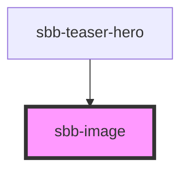

The `sbb-image` component is used to render an image.

Mainly from cdn.img.sbb.ch (with `imageSrc`), but we can set an external image too.
The size can be set with `pictureSizesConfig`.

<!-- Auto Generated Below -->

## Properties

| Property             | Attribute              | Description                                                                                                                                                                                                                                                                                                                                                                                                                                                                                                                                                                                                                                                                                                                                                                                                                                                                                                                                                                                                                                                                                                                                                                                                                                                                                                                                                                                                                                                                                                                                                                                                                                                                                                                                                               | Type                                                                                                          | Default          |
| -------------------- | ---------------------- | ------------------------------------------------------------------------------------------------------------------------------------------------------------------------------------------------------------------------------------------------------------------------------------------------------------------------------------------------------------------------------------------------------------------------------------------------------------------------------------------------------------------------------------------------------------------------------------------------------------------------------------------------------------------------------------------------------------------------------------------------------------------------------------------------------------------------------------------------------------------------------------------------------------------------------------------------------------------------------------------------------------------------------------------------------------------------------------------------------------------------------------------------------------------------------------------------------------------------------------------------------------------------------------------------------------------------------------------------------------------------------------------------------------------------------------------------------------------------------------------------------------------------------------------------------------------------------------------------------------------------------------------------------------------------------------------------------------------------------------------------------------------------- | ------------------------------------------------------------------------------------------------------------- | ---------------- |
| `alt`                | `alt`                  | An alt text is not always necessary (e.g. in teaser cards when additional link text is provided). In this case we can leave the value of the alt attribute blank, but the attribute itself still needs to be present. That way we can signal assistive technology, that they can skip the image.                                                                                                                                                                                                                                                                                                                                                                                                                                                                                                                                                                                                                                                                                                                                                                                                                                                                                                                                                                                                                                                                                                                                                                                                                                                                                                                                                                                                                                                                          | `string`                                                                                                      | `undefined`      |
| `aspectRatio`        | `aspect-ratio`         | Set an aspect ratio default is '16-9' (16/9) other values: 'free', '1-1', '1-2', '2-1', '2-3', '3-2', '3-4', '4-3', '4-5', '5-4', '9-16'                                                                                                                                                                                                                                                                                                                                                                                                                                                                                                                                                                                                                                                                                                                                                                                                                                                                                                                                                                                                                                                                                                                                                                                                                                                                                                                                                                                                                                                                                                                                                                                                                                  | `"1-1" \| "1-2" \| "16-9" \| "2-1" \| "2-3" \| "3-2" \| "3-4" \| "4-3" \| "4-5" \| "5-4" \| "9-16" \| "free"` | `'16-9'`         |
| `borderRadius`       | `border-radius`        | border-radius: if set to false, there will be no border-radius on the image                                                                                                                                                                                                                                                                                                                                                                                                                                                                                                                                                                                                                                                                                                                                                                                                                                                                                                                                                                                                                                                                                                                                                                                                                                                                                                                                                                                                                                                                                                                                                                                                                                                                                               | `boolean`                                                                                                     | `true`           |
| `caption`            | `caption`              | A caption can provide additional context to the image (e.g. descriptions and the like). Links will automatically receive tabindex=-1 if hideFromScreenreader is set to true. That way they will no longer become focusable.                                                                                                                                                                                                                                                                                                                                                                                                                                                                                                                                                                                                                                                                                                                                                                                                                                                                                                                                                                                                                                                                                                                                                                                                                                                                                                                                                                                                                                                                                                                                               | `string`                                                                                                      | `undefined`      |
| `copyright`          | `copyright`            | If a copyright text is provided, we will add it to the caption and create a structured data json-ld block with the copyright information.                                                                                                                                                                                                                                                                                                                                                                                                                                                                                                                                                                                                                                                                                                                                                                                                                                                                                                                                                                                                                                                                                                                                                                                                                                                                                                                                                                                                                                                                                                                                                                                                                                 | `string`                                                                                                      | `undefined`      |
| `copyrightHolder`    | `copyright-holder`     | Copyright holder can either be an Organization or a Person                                                                                                                                                                                                                                                                                                                                                                                                                                                                                                                                                                                                                                                                                                                                                                                                                                                                                                                                                                                                                                                                                                                                                                                                                                                                                                                                                                                                                                                                                                                                                                                                                                                                                                                | `"Organization" \| "Person"`                                                                                  | `'Organization'` |
| `customFocalPoint`   | `custom-focal-point`   | Set this to true, if you want to pass a custom focal point for the image. See full documentation here: https://docs.imgix.com/apis/rendering/focalpoint-crop                                                                                                                                                                                                                                                                                                                                                                                                                                                                                                                                                                                                                                                                                                                                                                                                                                                                                                                                                                                                                                                                                                                                                                                                                                                                                                                                                                                                                                                                                                                                                                                                              | `boolean`                                                                                                     | `false`          |
| `decoding`           | `decoding`             | If the lazy property is set to true, the module will automatically change the decoding to async, otherwise the decoding is set to auto which leaves the handling up to the browser. Read more about the decoding attribute here: https://developer.mozilla.org/en-US/docs/Web/API/HTMLImageElement/decoding                                                                                                                                                                                                                                                                                                                                                                                                                                                                                                                                                                                                                                                                                                                                                                                                                                                                                                                                                                                                                                                                                                                                                                                                                                                                                                                                                                                                                                                               | `"async" \| "auto" \| "sync"`                                                                                 | `'auto'`         |
| `disableAnimation`   | `disable-animation`    | Whether the fade animation from blurred to real image should be disabled.                                                                                                                                                                                                                                                                                                                                                                                                                                                                                                                                                                                                                                                                                                                                                                                                                                                                                                                                                                                                                                                                                                                                                                                                                                                                                                                                                                                                                                                                                                                                                                                                                                                                                                 | `boolean`                                                                                                     | `false`          |
| `focalPointDebug`    | `focal-point-debug`    | Set this to true, to receive visual guidance where the custom focal point is currently set.                                                                                                                                                                                                                                                                                                                                                                                                                                                                                                                                                                                                                                                                                                                                                                                                                                                                                                                                                                                                                                                                                                                                                                                                                                                                                                                                                                                                                                                                                                                                                                                                                                                                               | `boolean`                                                                                                     | `false`          |
| `focalPointX`        | `focal-point-x`        | Pass in a floating number between 0 (left) and 1 (right).                                                                                                                                                                                                                                                                                                                                                                                                                                                                                                                                                                                                                                                                                                                                                                                                                                                                                                                                                                                                                                                                                                                                                                                                                                                                                                                                                                                                                                                                                                                                                                                                                                                                                                                 | `number`                                                                                                      | `1`              |
| `focalPointY`        | `focal-point-y`        | Pass in a floating number between 0 (top) and 1 (bottom).                                                                                                                                                                                                                                                                                                                                                                                                                                                                                                                                                                                                                                                                                                                                                                                                                                                                                                                                                                                                                                                                                                                                                                                                                                                                                                                                                                                                                                                                                                                                                                                                                                                                                                                 | `number`                                                                                                      | `1`              |
| `imageSrc`           | `image-src`            | Right now the module is heavily coupled with the image delivery service imgix and depends on the original files being stored inside AEM. You can pass in any https://cdn.img.sbb.ch img src address you find on sbb.ch to play around with it. Just strip the url parameters and paste in the plain file address. If you want to know how to best work with this module with images coming from a different source, please contact the LYNE Core Team.                                                                                                                                                                                                                                                                                                                                                                                                                                                                                                                                                                                                                                                                                                                                                                                                                                                                                                                                                                                                                                                                                                                                                                                                                                                                                                                    | `string`                                                                                                      | `undefined`      |
| `importance`         | `importance`           | The importance attribute is fairly new attribute which should help the browser decide which resources it should prioritise during page load. We will set the attribute value based on the value, we receive in the loading attribute. 'eager', which we use for the largest image within the initial viewport, will set the attribute value to 'high'. 'lazy', which we use for images below the fold, will set the attribute value to 'low'.                                                                                                                                                                                                                                                                                                                                                                                                                                                                                                                                                                                                                                                                                                                                                                                                                                                                                                                                                                                                                                                                                                                                                                                                                                                                                                                             | `"auto" \| "high" \| "low"`                                                                                   | `'high'`         |
| `loading`            | `loading`              | With the support of native image lazy loading, we can now decide whether we want to load the image immediately or only once it is close to the visible viewport. The value eager is best used for images within the initial viewport. We want to load these images as fast as possible to improve the Core Web Vitals values. lazy on the other hand works best for images which are further down the page or invisible during the loading of the initial viewport.                                                                                                                                                                                                                                                                                                                                                                                                                                                                                                                                                                                                                                                                                                                                                                                                                                                                                                                                                                                                                                                                                                                                                                                                                                                                                                       | `"eager" \| "lazy"`                                                                                           | `'eager'`        |
| `lqip`               | `lqip`                 | If set to true, we show a blurred version of the image as placeholder before the actual image shows up. This will help to improve the perceived loading performance. Read more about the idea of lqip here: https://medium.com/@imgix/lqip-your-images-for-fast-loading-2523d9ee4a62                                                                                                                                                                                                                                                                                                                                                                                                                                                                                                                                                                                                                                                                                                                                                                                                                                                                                                                                                                                                                                                                                                                                                                                                                                                                                                                                                                                                                                                                                      | `boolean`                                                                                                     | `true`           |
| `performanceMark`    | `performance-mark`     | With performance.mark you can log a timestamp associated with the name you define in performanceMark when a certain event is happening. In our case we will log the performance.mark into the PerformanceEntry API once the image is fully loaded. Performance monitoring tools like SpeedCurve or Lighthouse are then able to grab these entries from the PerformanceEntry API and give us additional information and insights about our page loading behaviour. We are then also able to monitor these values over a long period to see if our performance increases or decreases over time. Best to use lowercase strings here, separate words with underscores or dashes.                                                                                                                                                                                                                                                                                                                                                                                                                                                                                                                                                                                                                                                                                                                                                                                                                                                                                                                                                                                                                                                                                             | `string`                                                                                                      | `undefined`      |
| `pictureSizesConfig` | `picture-sizes-config` | With the pictureSizesConfig object, you can pass in information into image about what kind of source elements should get rendered. mediaQueries accepts multiple Media Query entries which can get combined by defining a conditionOperator. Type is: stringified InterfaceImageAttributesSizesConfig-Object An example could look like this: {    "breakpoints": [      {        "image": {          "height": "675",          "width": "1200"        },        "mediaQueries": [          {            "conditionFeature": "min-width",            "conditionFeatureValue": {              "lyneDesignToken": true,              "value": "sbb-breakpoint-large-min"            },            "conditionOperator": false          }        ]      },      {        "image": {          "height": "549",          "width": "976"        },        "mediaQueries": [          {            "conditionFeature": "min-width",            "conditionFeatureValue": {              "lyneDesignToken": true,              "value": "sbb-breakpoint-small-min"            },            "conditionOperator": false          }        ]      },      {        "image": {          "height": "180",          "width": "320"        },        "mediaQueries": [          {            "conditionFeature": "max-width",            "conditionFeatureValue": {              "lyneDesignToken": true,              "value": "sbb-breakpoint-micro-max"            },            "conditionOperator": "and"          },          {            "conditionFeature": "orientation",            "conditionFeatureValue": {              "lyneDesignToken": false,              "value": "landscape"            },            "conditionOperator": false          }        ]      }    ]  } | `string`                                                                                                      | `undefined`      |

## Dependencies

### Used by

 - [sbb-teaser-hero](../sbb-teaser-hero)

### Graph

----------------------------------------------

