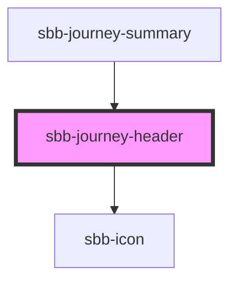

# sbb-journey-header

<!-- Auto Generated Below -->

## Properties

| Property                   | Attribute     | Description                                                                                                                                               | Type                                               | Default     |
| -------------------------- | ------------- | --------------------------------------------------------------------------------------------------------------------------------------------------------- | -------------------------------------------------- | ----------- |
| `destination` _(required)_ | `destination` | Destination location for the journey header.                                                                                                              | `string`                                           | `undefined` |
| `level`                    | `level`       | Journey header markup: depending on the context where it will be used, it is important to pick the correct markup element to match the correct semantics. | `"1" \| "2" \| "3" \| "4" \| "5" \| "6" \| "span"` | `'span'`    |
| `negative`                 | `negative`    | Negative coloring variant flag.                                                                                                                           | `boolean`                                          | `false`     |
| `origin` _(required)_      | `origin`      | Origin location for the journey header.                                                                                                                   | `string`                                           | `undefined` |
| `roundTrip`                | `round-trip`  | Whether the journey is a round trip. If so, the icon changes to a round-trip one.                                                                         | `boolean`                                          | `undefined` |
| `size`                     | `size`        | Journey header size.                                                                                                                                      | `"l" \| "m"`                                       | `'m'`       |

## Dependencies

### Used by

 - [sbb-journey-summary](../sbb-journey-summary)

### Depends on

- [sbb-icon](../sbb-icon)

### Graph

----------------------------------------------

