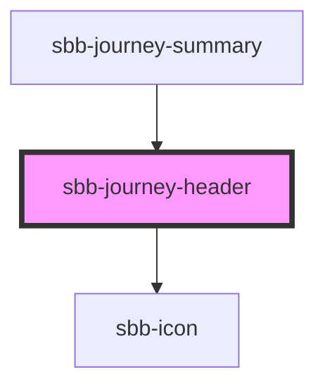

# sbb-journey-header

The `sbb-journey-header` is a component used to display the journey's details.

The component has two required properties, named `origin` and `destination`, which are the two ends of the journey.
An icon is placed between them: if the property `roundTrip` is set to false (default), the icon is 
an arrow pointing to the `destination`, otherwise it is a double arrow to display the round-trip.

The component has two sizes, named `m` (default) and `l`, and a `negative` background variant.
The component's markup can be set using the `level` property: the default value is `none`, which renders a `<span>` tag;
otherwise, a heading can be chosen using numbers from `1` to `6`.

### Accessibility

The component has some hidden elements in order to be correctly read from a screen-reader.

The following example will be read as (locale: ENG): `Connection from Point A to Point B.`.
```html
<sbb-journey-header origin="Point A" destination="Point B" />
```

The following one will be read as (locale: ENG): `Connection from Point A to Point B and back to Point A.`.
```html
<sbb-journey-header origin="Point A" destination="Point B" round-trip="true"/>
```

### Usage

Basic usage, rendered as `<span>`:
```html
<sbb-journey-header origin="Point A" destination="Point B"/>
```

Size `l`, rendered as `<h3>`:
```html
<sbb-journey-header origin="Point A" destination="Point B" size="l" level="3"/>
```

Negative variant, round-trip:
```html
<sbb-journey-header origin="Point A" destination="Point B" round-trip="true" negative="true"/>
```

<!-- Auto Generated Below -->


## Properties

| Property                   | Attribute     | Description                                                                                                                                               | Type                                               | Default     |
| -------------------------- | ------------- | --------------------------------------------------------------------------------------------------------------------------------------------------------- | -------------------------------------------------- | ----------- |
| `destination` _(required)_ | `destination` | Destination location for the journey header.                                                                                                              | `string`                                           | `undefined` |
| `level`                    | `level`       | Journey header markup: depending on the context where it will be used, it is important to pick the correct markup element to match the correct semantics. | `"1" \| "2" \| "3" \| "4" \| "5" \| "6" \| "none"` | `'none'`    |
| `negative`                 | `negative`    | Negative coloring variant flag.                                                                                                                           | `boolean`                                          | `false`     |
| `origin` _(required)_      | `origin`      | Origin location for the journey header.                                                                                                                   | `string`                                           | `undefined` |
| `roundTrip`                | `round-trip`  | Whether the journey is a round trip. If so, the icon changes to a round-trip one.                                                                         | `boolean`                                          | `undefined` |
| `size`                     | `size`        | Journey header size.                                                                                                                                      | `"l" \| "m"`                                       | `'m'`       |


## Dependencies

### Used by

 - [sbb-journey-summary](../sbb-journey-summary)

### Depends on

- [sbb-icon](../sbb-icon)

### Graph


----------------------------------------------


