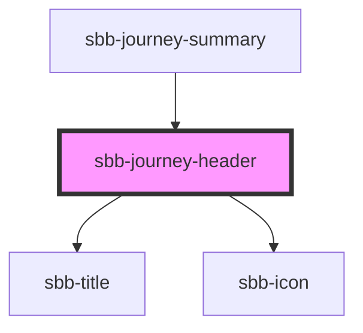

The `sbb-journey-header` is a component used to display the journey's details.

### Origin and destination

The component has two required properties, named `origin` and `destination`, which represents the two ends of the journey.
An icon is placed between them: if the property `roundTrip` is set to false (default), the icon is 
an arrow pointing to the `destination`, otherwise it is a double arrow to display the round-trip.

```html
<sbb-journey-header origin="Point A" destination="Point B" />

<sbb-journey-header origin="Point A" destination="Point B" round-trip/>
```

### Display properties

The component has a `level` property, which is passed to its inner `sbb-title` component; 
it is rendered as a heading from `h1` to `h6`. Default `level` is `3`. 
The component also has two sizes, named `m` (default) and `l`, and a `negative` background variant.

```html
<sbb-journey-header origin="Point A" destination="Point B" size="l" />

<sbb-journey-header origin="Point A" destination="Point B" level="5"/>

<sbb-journey-header origin="Point A" destination="Point B" negative/>
```

## Accessibility

The component has some hidden elements in order to be correctly read from a screen-reader.

The following example will be read as (locale: ENG): `Connection from Point A to Point B.`.

```html
<sbb-journey-header origin="Point A" destination="Point B" />
```

The following one will be read as (locale: ENG): `Connection from Point A to Point B and back to Point A.`.

```html
<sbb-journey-header origin="Point A" destination="Point B" round-trip="true"/>
```

<!-- Auto Generated Below -->


## Properties

| Property                   | Attribute     | Description                                                                       | Type                                     | Default     |
| -------------------------- | ------------- | --------------------------------------------------------------------------------- | ---------------------------------------- | ----------- |
| `destination` _(required)_ | `destination` | Destination location for the journey header.                                      | `string`                                 | `undefined` |
| `level`                    | `level`       | Heading level of the journey header element (e.g. h1-h6).                         | `"1" \| "2" \| "3" \| "4" \| "5" \| "6"` | `'3'`       |
| `negative`                 | `negative`    | Negative coloring variant flag.                                                   | `boolean`                                | `false`     |
| `origin` _(required)_      | `origin`      | Origin location for the journey header.                                           | `string`                                 | `undefined` |
| `roundTrip`                | `round-trip`  | Whether the journey is a round trip. If so, the icon changes to a round-trip one. | `boolean`                                | `undefined` |
| `size`                     | `size`        | Journey header size.                                                              | `"l" \| "m"`                             | `'m'`       |


## Dependencies

### Used by

 - [sbb-journey-summary](../sbb-journey-summary)

### Depends on

- [sbb-title](../sbb-title)
- [sbb-icon](../sbb-icon)

### Graph


----------------------------------------------


