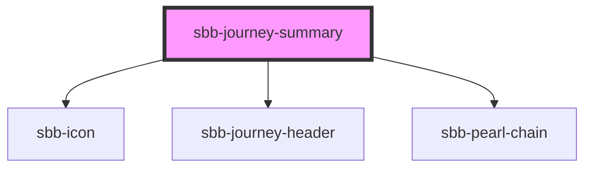

The `<sbb-journey-summary>` displays  the main information of a journey. It contains information about the arrival and depature, the date when the journey takes place and how long the trip will be. 
It also consists of a pearl-chain with arrival and departure time. In addtition to that, it is also possible to display the walktimes at the begin and end of a journey. 
The component has a unnamed slot where other elements can be added, i.e. buttons.

## Usage
The Example below shows how to render the component with a button in the slot. To be displayed correctly, the config prop has to include almost all probierties mentioned in the table below. It is important that the arrival and departure properties consist of an valid ISO 8601 date string. If this is not the case, the times and the date will not be displayed
```
<sbb-journey-summary config={config}><sbb-button /></sbb-journey-summary>
```
<!-- Auto Generated Below -->


## Properties

| Property              | Attribute | Description     | Type                                                                                                                                                                                         | Default     |
| --------------------- | --------- | --------------- | -------------------------------------------------------------------------------------------------------------------------------------------------------------------------------------------- | ----------- |
| `config` _(required)_ | --        | The config prop | `{ legs: string; vias: string[]; origin: string; destination: string; arrivalWalk: number; departure: TimeQuayWrapper; arrival: TimeQuayWrapper; departureWalk: number; duration: number; }` | `undefined` |


## Dependencies

### Depends on

- [sbb-icon](../sbb-icon)
- [sbb-journey-header](../sbb-journey-header)
- [sbb-pearl-chain](../sbb-pearl-chain)

### Graph


----------------------------------------------


