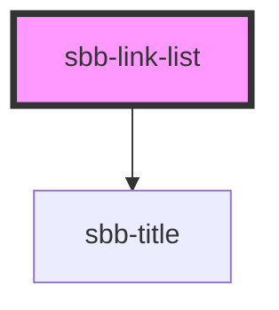

# sbb-link-list

<!-- Auto Generated Below -->

## Properties

| Property         | Attribute         | Description                                                           | Type                                                                       | Default                               |
| ---------------- | ----------------- | --------------------------------------------------------------------- | -------------------------------------------------------------------------- | ------------------------------------- |
| `horizontalFrom` | `horizontal-from` | Selected breakpoint from which the list is rendered horizontally.     | `"large" \| "medium" \| "micro" \| "small" \| "ultra" \| "wide" \| "zero"` | `undefined`                           |
| `negative`       | `negative`        | Negative coloring variant flag                                        | `boolean`                                                                  | `undefined`                           |
| `orientation`    | `orientation`     | The direction in which the list will be shown vertical or horizontal. | `"horizontal" \| "vertical"`                                               | `'vertical'`                          |
| `titleId`        | `title-id`        | This id will be forwarded to the relevant inner element.              | `string`                                                                   | ``sbb-link-list-heading-${++nextId}`` |
| `titleLevel`     | `title-level`     | The semantic level of the title, e.g. 3 = h3                          | `"1" \| "2" \| "3" \| "4" \| "5" \| "6"`                                   | `'2'`                                 |
| `titleText`      | `title-text`      | The title text we want to show before the list                        | `string`                                                                   | `undefined`                           |

## Dependencies

### Depends on

- [sbb-title](../sbb-title)

### Graph

----------------------------------------------

