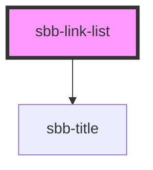

The `<sbb-link-list>` is a component that can be used to collect more `sbb-link`s; 
it will automatically set variant `block` on nested `sbb-link` instances, 
and it will sync the `size` and `negative` property.

```html
<sbb-link-list>
  <sbb-link href='https://www.sbb.ch/en/help-and-contact/refunds-compensation/ticket-refunds.html'>Refunds</sbb-link>
  <sbb-link href='https://www.sbb.ch/en/help-and-contact/lost-found-office/submit-loss-report.html'>Loss Report</sbb-link>
  ...
</sbb-link-list>

<sbb-link-list size='s' negative>
  <sbb-link href='https://www.sbb.ch/en/help-and-contact/refunds-compensation/ticket-refunds.html'>Refunds</sbb-link>
  <sbb-link href='https://www.sbb.ch/en/help-and-contact/lost-found-office/submit-loss-report.html'>Loss Report</sbb-link>
  ...
</sbb-link-list>
```

### Title

The component can display an optional title, which is visually shown as a level-5 `sbb-title` 
and is used as the `aria-labelledby` attribute of the `ul` element.
The title is projected using the `title` slot or, alternatively, the `titleContent` property.

```html
<sbb-link-list title-content="Help &amp; Contact">
  ...
</sbb-link-list>
```

### Orientation

The `orientation` property is used to set links' orientation; possible values are `horizontal` and `vertical` (default).
The optional property `horizontalFrom` can be used in combination with `orientation='vertical'` 
to indicate the minimum breakpoint from which the orientation changes to `horizontal`.
The title will not be displayed in the horizontal orientation.

```html
<sbb-link-list horizontal-from="medium">
<sbb-link href='https://www.sbb.ch/en/help-and-contact/refunds-compensation/ticket-refunds.html'>Refunds</sbb-link>
<sbb-link href='https://www.sbb.ch/en/help-and-contact/lost-found-office/submit-loss-report.html'>Loss Report</sbb-link>
...
</sbb-link-list>
```

<!-- Auto Generated Below -->


## Properties

| Property         | Attribute         | Description                                                                                                                                         | Type                                                                       | Default      |
| ---------------- | ----------------- | --------------------------------------------------------------------------------------------------------------------------------------------------- | -------------------------------------------------------------------------- | ------------ |
| `horizontalFrom` | `horizontal-from` | Selected breakpoint from which the list is rendered horizontally.                                                                                   | `"large" \| "medium" \| "micro" \| "small" \| "ultra" \| "wide" \| "zero"` | `undefined`  |
| `negative`       | `negative`        | Whether to render the link list and nested sbb-link instances as negative. This will overwrite the negative attribute of nested sbb-link instances. | `boolean`                                                                  | `undefined`  |
| `orientation`    | `orientation`     | The orientation in which the list will be shown vertical or horizontal.                                                                             | `"horizontal" \| "vertical"`                                               | `'vertical'` |
| `size`           | `size`            | Text size of the nested sbb-link instances. This will overwrite the size attribute of nested sbb-link instances.                                    | `"m" \| "s" \| "xs"`                                                       | `'s'`        |
| `titleContent`   | `title-content`   | The title text we want to show before the list.                                                                                                     | `string`                                                                   | `undefined`  |
| `titleLevel`     | `title-level`     | The semantic level of the title, e.g. 2 = h2.                                                                                                       | `"1" \| "2" \| "3" \| "4" \| "5" \| "6"`                                   | `'2'`        |


## Dependencies

### Depends on

- [sbb-title](../sbb-title)

### Graph


----------------------------------------------


