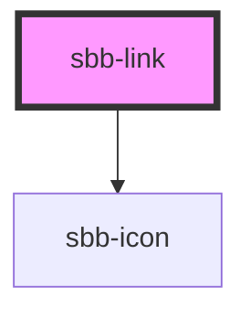

# sbb-link
Link will become a button if no href is given and no is-static flag is set.
Link will become a span if the is-static flag is set to true.
  
<!-- Auto Generated Below -->

## Properties

| Property                   | Attribute                   | Description                                                                                                                                                                                | Type                              | Default     |
| -------------------------- | --------------------------- | ------------------------------------------------------------------------------------------------------------------------------------------------------------------------------------------ | --------------------------------- | ----------- |
| `accessibilityDescribedby` | `accessibility-describedby` | This will be forwarded as aria-describedby to the relevant nested element.                                                                                                                 | `string`                          | `undefined` |
| `accessibilityLabel`       | `accessibility-label`       | This will be forwarded as aria-label to the relevant nested element.                                                                                                                       | `string`                          | `undefined` |
| `accessibilityLabelledby`  | `accessibility-labelledby`  | This will be forwarded as aria-labelledby to the relevant nested element.                                                                                                                  | `string`                          | `undefined` |
| `disabled`                 | `disabled`                  | Disabled attribute if link is used as button (optional)                                                                                                                                    | `boolean`                         | `undefined` |
| `download`                 | `download`                  | If set to true, the browser will show the download dialog on click (optional).                                                                                                             | `boolean`                         | `undefined` |
| `form`                     | `form`                      | Form attribute if link is used as button (optional)                                                                                                                                        | `string`                          | `undefined` |
| `href`                     | `href`                      | The href value you want to link to (if its not present link becomes a button)                                                                                                              | `string`                          | `undefined` |
| `icon`                     | `icon`                      | The icon name we want to use, choose from the small icon variants from the ui-icons category from here https://lyne.sbb.ch/tokens/icons/ (optional). Inline variant doesn't support icons. | `string`                          | `undefined` |
| `iconFlip`                 | `icon-flip`                 | Decide whether the icon should get flipped horizontally to the left or to the right.                                                                                                       | `boolean`                         | `undefined` |
| `iconPlacement`            | `icon-placement`            | The icon can either be place before or after the text.                                                                                                                                     | `"end" \| "start"`                | `'start'`   |
| `idValue`                  | `id-value`                  | Pass in an id, if you need to identify the link element (optional).                                                                                                                        | `string`                          | `undefined` |
| `isStatic`                 | `is-static`                 | If this is set to true an span element will be used instead of an anchor or a button                                                                                                       | `boolean`                         | `false`     |
| `name`                     | `name`                      | Name attribute if link is used as button (optional)                                                                                                                                        | `string`                          | `undefined` |
| `negative`                 | `negative`                  | Negative coloring variant flag                                                                                                                                                             | `boolean`                         | `undefined` |
| `textSize`                 | `text-size`                 | Text size, the link should get in the non button variation. With inline variant, the text size adapts to where it is used.                                                                 | `"m" \| "s" \| "xs"`              | `'s'`       |
| `type`                     | `type`                      | Type attribute if link is used as button (optional)                                                                                                                                        | `"button" \| "reset" \| "submit"` | `undefined` |
| `variant`                  | `variant`                   | Applies link inline styles (underline, inherit coloring/font-size etc).                                                                                                                    | `"block" \| "inline"`             | `'block'`   |

## Slots

| Slot     | Description                                  |
| -------- | -------------------------------------------- |
| `"icon"` | Slot used to display the icon, if one is set |

## Dependencies

### Depends on

- [sbb-icon](../sbb-icon)

### Graph

----------------------------------------------

