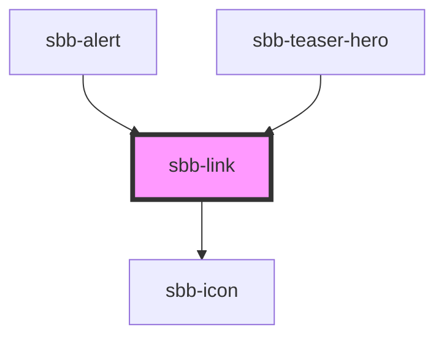

The `sbb-link` component provides the same functionality as a native `<a>` enhanced with the SBB Design.

### Slots

The link text is provided via an unnamed slot; the component can optionally display a `sbb-icon` using 
the `iconName` property or via custom content using the `icon` slot. 
By default, the icon is placed at the component's end, but this can be changed using the `iconPlacement` property.

```html
<sbb-link href="https://www.sbb.ch" icon-name='chevron-small-right-small'>
  Help
</sbb-link>

<sbb-link href="https://www.sbb.ch" icon-name='chevron-small-left-small' icon-placement='start'>
  Contact
</sbb-link>
```

### Link/button properties

The component can be internally rendered as a button or as a link,
depending on the value of the `href` property, so the associated properties are available
(`href`, `target`, `rel` and `download` for link; `type`, `name`, `value` and `form` for button).
If `isStatic` is set, the component will be rendered as a link without any user interaction.
Please note that if the `sbb-link` is placed inside another anchor or button tag, 
it is internally rendered as a span in order to not break HTML functionality.

```html
<sbb-link href="https://github.com/lyne-design-system/lyne-components" target='_blank'>
  Travel-cards and tickets
</sbb-link>

<sbb-link type='button' name='tickets' form='buy' value='tickets'>
  Travel-cards and tickets
</sbb-link>
```
 
### Variants

The component has two variants (`block`, which is the default, and `inline`), that can be set using the `variant` property,
and it has also three sizes (`xs`, `s`, which is the default, and `m`) that are relevant only in `variant='block`'.
The component can be displayed in `disabled` state using the self-named property.

```html
<sbb-link size='m'>Refunds</sbb-link>

<p>
  Some informative text.
  <sbb-link variant='inline' href='#info'>Show more.</sbb-link>
</p>

<sbb-link disabled>Refunds</sbb-link>
```

<!-- Auto Generated Below -->


## Properties

| Property        | Attribute        | Description                                                                                                                                                            | Type                              | Default     |
| --------------- | ---------------- | ---------------------------------------------------------------------------------------------------------------------------------------------------------------------- | --------------------------------- | ----------- |
| `disabled`      | `disabled`       | Whether the button is disabled.                                                                                                                                        | `boolean`                         | `false`     |
| `download`      | `download`       | Whether the browser will show the download dialog on click.                                                                                                            | `boolean`                         | `undefined` |
| `form`          | `form`           | The <form> element to associate the button with.                                                                                                                       | `string`                          | `undefined` |
| `href`          | `href`           | The href value you want to link to (if it is not present link becomes a button).                                                                                       | `string`                          | `undefined` |
| `iconName`      | `icon-name`      | The icon name we want to use, choose from the small icon variants from the ui-icons category from here https://icons.app.sbb.ch. Inline variant doesn't support icons. | `string`                          | `undefined` |
| `iconPlacement` | `icon-placement` | Moves the icon to the end of the component if set to true.                                                                                                             | `"end" \| "start"`                | `'start'`   |
| `isStatic`      | `is-static`      | Set this property to true if you want only a visual representation of a link, but no interaction (a span instead of a link/button will be rendered).                   | `boolean`                         | `false`     |
| `name`          | `name`           | The name attribute to use for the button.                                                                                                                              | `string`                          | `undefined` |
| `negative`      | `negative`       | Negative coloring variant flag.                                                                                                                                        | `boolean`                         | `false`     |
| `rel`           | `rel`            | The relationship of the linked URL as space-separated link types.                                                                                                      | `string`                          | `undefined` |
| `size`          | `size`           | Text size, the link should get in the non-button variation. With inline variant, the text size adapts to where it is used.                                             | `"m" \| "s" \| "xs"`              | `'s'`       |
| `target`        | `target`         | Where to display the linked URL.                                                                                                                                       | `string`                          | `undefined` |
| `type`          | `type`           | The type attribute to use for the button.                                                                                                                              | `"button" \| "reset" \| "submit"` | `undefined` |
| `value`         | `value`          | The value attribute to use for the button.                                                                                                                             | `string`                          | `undefined` |
| `variant`       | `variant`        | Variant of the link (block or inline).                                                                                                                                 | `"block" \| "inline"`             | `'block'`   |


## Slots

| Slot        | Description                                  |
| ----------- | -------------------------------------------- |
| `"icon"`    | Slot used to display the icon, if one is set |
| `"unnamed"` | Link Content                                 |


## Dependencies

### Used by

 - [sbb-alert](../sbb-alert)
 - [sbb-teaser-hero](../sbb-teaser-hero)

### Depends on

- [sbb-icon](../sbb-icon)

### Graph


----------------------------------------------


