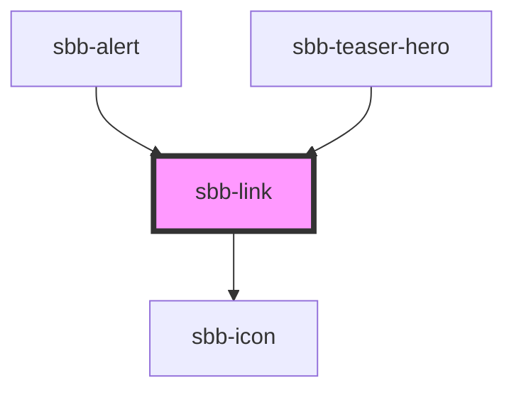

The `<sbb-link>`can both be used as an anchor (`<a>`)
(if the href property is set) or as a button. If the `<sbb-link>` is placed inside another
anchor or button tag, it is internally rendered as a span in order to not break HTML functionality.
  
<!-- Auto Generated Below -->

## Properties

| Property        | Attribute        | Description                                                                                                                                                            | Type                              | Default     |
| --------------- | ---------------- | ---------------------------------------------------------------------------------------------------------------------------------------------------------------------- | --------------------------------- | ----------- |
| `disabled`      | `disabled`       | Whether the button is disabled.                                                                                                                                        | `boolean`                         | `false`     |
| `download`      | `download`       | Whether the browser will show the download dialog on click.                                                                                                            | `boolean`                         | `undefined` |
| `form`          | `form`           | The <form> element to associate the button with.                                                                                                                       | `string`                          | `undefined` |
| `href`          | `href`           | The href value you want to link to (if it is not present link becomes a button).                                                                                       | `string`                          | `undefined` |
| `iconName`      | `icon-name`      | The icon name we want to use, choose from the small icon variants from the ui-icons category from here https://icons.app.sbb.ch. Inline variant doesn't support icons. | `string`                          | `undefined` |
| `iconPlacement` | `icon-placement` | Moves the icon to the end of the component if set to true.                                                                                                             | `"end" \| "start"`                | `'start'`   |
| `isStatic`      | `is-static`      | Set this property to true if you want only a visual representation of a link, but no interaction (a span instead of a link/button will be rendered).                   | `boolean`                         | `false`     |
| `name`          | `name`           | The name attribute to use for the button.                                                                                                                              | `string`                          | `undefined` |
| `negative`      | `negative`       | Negative coloring variant flag.                                                                                                                                        | `boolean`                         | `false`     |
| `rel`           | `rel`            | The relationship of the linked URL as space-separated link types.                                                                                                      | `string`                          | `undefined` |
| `size`          | `size`           | Text size, the link should get in the non-button variation. With inline variant, the text size adapts to where it is used.                                             | `"m" \| "s" \| "xs"`              | `'s'`       |
| `target`        | `target`         | Where to display the linked URL.                                                                                                                                       | `string`                          | `undefined` |
| `type`          | `type`           | The type attribute to use for the button.                                                                                                                              | `"button" \| "reset" \| "submit"` | `undefined` |
| `value`         | `value`          | The value attribute to use for the button.                                                                                                                             | `string`                          | `undefined` |
| `variant`       | `variant`        | Variant of the link (block or inline).                                                                                                                                 | `"block" \| "inline"`             | `'block'`   |

## Slots

| Slot        | Description                                  |
| ----------- | -------------------------------------------- |
| `"icon"`    | Slot used to display the icon, if one is set |
| `"unnamed"` | Link Content                                 |

## Dependencies

### Used by

 - [sbb-alert](../sbb-alert)
 - [sbb-teaser-hero](../sbb-teaser-hero)

### Depends on

- [sbb-icon](../sbb-icon)

### Graph

----------------------------------------------

